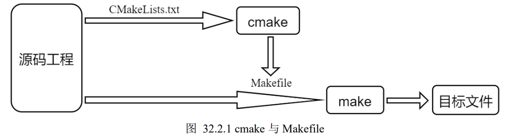

# Cmake note 

__cmake 的诞生主要是为了解决直接使用 make+Makefile 这种方式无法实现跨平台的问题，所以 cmake 是可以实现跨平台的编译工具.cmake允许开发者编写一种与平台无关的 `CMakeLists.txt` 文件来制定整个工程的编译流程，再根据具体的编译平台，生成本地化的 Makefile 和工程文件，最后执行 make 编译__

***Cmake最主要的是`CMakeLists.txt`***
 
 

CMake通过cmake + CMakeLists.txt路径来执行，如cmake ./  
 执行指令后会生成Makefile文件，再执行make即可

### CMakeLists.txt
1. `__project(XXX)__` : 设置工程的`名称`，多个参数使用空格进行分割而不是逗号
2. `__add_executable(xxx   xxx)__` : 此命令用于生成一个可执行文件，传入两个参数 ，第一个是表示生成的可执行文件对应的`文件名`，第二个是表示对应的`源文件`
3. 