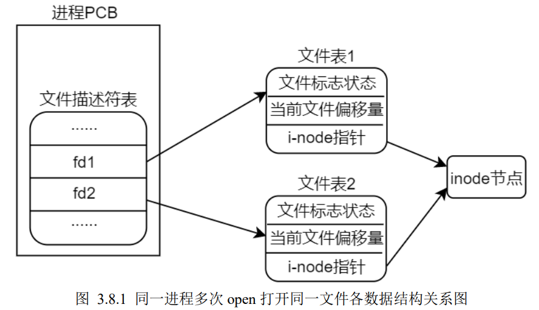

# Linux 应用开发

### 库函数
- 在 Linux 下，通常以动态（.so）
库文件的形式提供，存放在根文件系统/lib 目录下，C 语言库函数构建于系统调用之上
- 有些库函数并不调用任何系统调用,而有些库函数则会使用系统调用来完成相关操作
-  C 语言库函数的设计是为了提供比底层系统调用更为方便、更为好用、且更具有可移植性的调用接口

##### 库函数与系统调用的区别
1. 库函数是属于应用层，而系统调用是内核提供给应用层的编程接口，属于系统内核的一部分
2. 库函数运行在用户空间，调用系统调用会由用户空间（用户态）陷入到内核空间（内核态）
3. 库函数通常是有缓存的，而系统调用是无缓存的，所以在性能、效率上，库函数通常要优于系统调
用
4. 可移植性：库函数相比于系统调用具有更好的可移植性，通常对于不同的操作系统，其内核向应用
层提供的系统调用往往都是不同，譬如系统调用的定义、功能、参数列表、返回值等往往都是不一
样的；而对于 C 语言库函数来说，由于很多操作系统都实现了 C 语言库，C 语言库在不同的操作系统之间其接口定义几乎是一样的，所以库函数在不同操作系统之间相比于系统调用具有更好的可移植性

********************************
# 文件IO

-  Linux下一个进程最多可以打开**1024**个文件，这个限制数是可以设置的。
-  文件描述符是从0开始的，一般都是从3开始的，因为0分配给了系统标准输入，1分配给标准输出，2分配给标准错误
  

### 静态文件与inode
  1. *__硬盘的最小储存单位是扇区（Sector)(512字节），文件存取的最小单位是块，常见的是八个扇区组成一个块（4KB)__*
  2. *__磁盘在分区格式化的时候会分成两个区域：数据区存放数据，inode区存放inode table，且每个文件都有都有一个独一无二的inode(有一个相对应的数字编号)__*


  
  - 每一个文件都有唯一的一个 inode，每一个 inode 都有一个与之相对应的数字编号，通过这个数字编号就可以找到 inode table 中所对应的 inode
- 快速格式化只是删除了inode table，真正的存储文件数据没有动
- 打开一个文件，经历以下步骤：
  1. 找到文件对应的inode编号 
  2. 根据inode号在inode table中找到对应的inode结构体 
  3. 根据inode结构体对应的信息，确定文件数据所在的硬盘块区，读出数据

### 文件打开的状态
- open函数打开文件的时候，内核会申请一段内存（缓冲区），将静态文件的数据从磁盘读取到内存中进行操作（此时内存中的这份文件数据叫**动态文件、内核缓冲区**，磁盘中的数据为**静态文件**），打开文件后，对这个文件的读写操作都是针对内存中的这份文件进行操作
- 文件读取到内存中后，此时动态文件和静态文件就不同步了，同步工作由**内核**完成
- (磁盘操作）对文件中一个字节的修改也需要将字节所在的block全部读出来，修改后再写回磁盘中，读写不灵活；（内存操作）但是内存可以按字节为单位进行操作，可随机操作任意地址的数据，很灵活
- 内核缓冲区的设计目的是为了提高文件 I/O 的速度和效率，使得系统调用 read()、write()的操作更为快速，不需要等待磁盘操作（将数据写入到磁盘或从磁盘读取出数据），磁盘操作通常是比较缓慢的；同时也减少了内核操作磁盘的次数，因为如果没有内核缓冲区，每次write文件都会执行一次磁盘操作
  
### PCB（process control block)
  1. *__每个进程都有一个PCB来记录进程的状态信息等来管理进程__*
  2. *__PCB中有一个指针指向文件描述符表（File descritors),文件描述符表中的每个元素索引到对应的文件表（File table），文件表也是一个数据结构体，其中记录了很多文件相关的信息，譬如文件状态标志、引用计数、当前文件的读写偏移量及`i-node指针`（指向该文件对应的inode）等__*
  3. __文件描述符记录了这个进程打开了多少个文件以及文件的信息__
   


### 返回错误处理和errno
- __在 Linux 系统下对常见的错误做了一个编号，每一个编号都代表着每一种不同的错误类型，当函数执行发生错误的时候，操作系统会将这个错误所对应的编号
赋值给 errno 变量，每一个进程（程序）都维护了自己的 errno 变量，它是程序中的全局变量，该变量用于存储就近发生的函数执行错误编号，也就意味着下一次的错误码会覆盖上一次的错误码__
- errno本质是一个int的全局变量，用来储存错误编号，但是不是所有系统调用或库函数出错时操作系统都会设置errno，这需要查man手册
- errno需要头文件errno.h

### exit、_exit、_Exit函数
 __*在 Linux 系统下，进程正常退出除了可以使用 return 之外，还可以使用 exit()、_exit()以及_Exit()*__

1. main 函数中使用 return 后返回，return 执行后把控制权交给调用函数，结束该进程。调用_exit()函数会清除其使用的内存空间，并销毁其在内核中的各种数据结构，关闭进程的所有文件描述符，并结束进程、将控制权交给操作系统，___Exit函数__ 和 __exit函数__ 功能一样
2. exit函数是标准库函数，_exit和_Exit是系统调用，执行exit()会执行一些清理工作，最后调用_exit()函数
3. 三种终止进程的方法：
   1. main中return
   2. 调用Linux系统调用_exit或_Exit函数
   3. 调用库函数exit（推荐）

### 空洞文件（hole file)
空洞文件是指在某一段连续字节空间中没有写入任何数据，形成了空洞；实际上空洞部分不会占据任何物理空间，直到某时刻对空洞部分写入数据时才会给它分配空间，但是空洞文件形成时，逻辑上文件的大小是包含了空洞部分的大小

### 多次打开同一个文件
- 一个进程内多次 open 打开同一个文件，那么会得到多个不同的文件描述符 fd，同理在关闭文件的时候也需要调用 close 依次关闭各个文件描述符
- 一个进程内多次 open 打开同一个文件，在内存中并不会存在多份动态文件
- 一个进程内多次 open 打开同一个文件，不同文件描述符所对应的读写位置偏移量是相互独立的
   1. 同一个文件被多次打开，会得到多个不同的文件描述符，也就意味着会有多个不同的文件表，而文件读写偏移量信息就记录在文件表数据结构中，所以从这里可以推测不同的文件描述符所对应的读写偏移量是相互独立的，并没有关联在一起，并且文件表中 i-node 指针指向的都是同一个inode
   
   

- 动态文件何时被关闭呢？当文件的引用计数为 0 时，系统会自动将其关闭，同一个文件被打开多次，文件表中会记录该文件的引用计数
  

### 复制文件描述符(通过dup、dup2函数)
*__复制得到的文件描述符和旧的都指向同一个文件表，权限相同__(两个文件描述符的属性是一样，譬如对文件的读写权限、文件状态标志、文件偏移量等，所以从这里也可知道“复制”的含义实则是复制文件表)*


### 文件共享
*__文件共享指的是同一个文件（譬如磁盘上的同一个文件，对应同一个 inode）被多个独立的读写体同时进行 IO 操作__*

文件共享的核心：如何制造出多个不同的文件描述符来指向同一个文件

- 常见三种实现方式：
1. 同一个进程中多次调用 open 函数打开同一个文件



多次调用 open 函数打开同一个文件会得到多个不同的文件描述符，并且多个文件描述符对应多个不同的文件表，所有的文件表都索引到了同一inode 节点，也就是磁盘上的同一个文件

2. 不同进程中分别使用 open 函数打开同一个文件
   


各自的文件表都索引到了同一个 inode 节点，从而实现共享文件

3. 同一个进程中通过 dup（dup2）函数对文件描述符进行复制


********************************
# 标准IO库
*当使用标准IO库函数打开或创建一个文件的时候，会返回一个指向FILE类型对象读指针（FILE\*),使用该 FILE 指针与被打开或创建的文件相关联，然后该 FILE 指针就用于后续的标准 I/O 操作（使用标准 I/O 库函数进行 I/O 操作)* __(FILE 指针的作用相当于文件描述符，只不过 FILE 指针用于标准 I/O 库函数中、而文件描述符则用于文件I/O 系统调用中)__
- FILE数据结构定义于在stdio.h中

### 标准输入、输出和标准错误
- 每个进程启动之后都会默认打开标准输入、标准输出以及标准错误
- 在应用编程中可以使用宏 STDIN_FILENO、
STDOUT_FILENO 和 STDERR_FILENO 分别代表 0、1、2(文件描述符），这些宏定义在 unistd.h 头文件中，如下：
```
#define STDIN_FILENO 0 /* Standard input. */
#define STDOUT_FILENO 1 /* Standard output. */
#define STDERR_FILENO 2 /* Standard error output. */
```
标准库函数的标准IO定义是(标准IO中是无法用文件描述符来对文件进行IO操作）：
```
/* Standard streams. */
extern struct _IO_FILE *stdin; /* Standard input stream. */
extern struct _IO_FILE *stdout; /* Standard output stream. */ //struct _IO_FILE 结构体就是 FILE 结构体，使用了 typedef 进行了重命名
extern struct _IO_FILE *stderr; /* Standard error output stream. */
/* C89/C99 say they're macros. Make them happy. */
#define stdin stdin
#define stdout stdout
#define stderr stderr
```

### 格式控制字符串
格式控制字符串由两个部分组成：普通字符（非%字符）和转换说明

`%[flags][width][.precision][length]type`

type和%是必须的，常用的type有：
1. `%d`: int类型（十进制）
2. `%x`: unsigned int(无符号十六进制)
3. `%o`: unsigned int(无符号八进制)
4. `%d`: double(浮点数)
5. `%s`: string(字符串)


### 刷新文件IO的内核缓冲区

__强制将文件 I/O 内核缓冲区中缓存的数据写入（刷新）到磁盘设备中，对于某些应用程序来说，可能是很有必要的,因为有些操作需要确保前面操作的数据已经真正存入到磁盘中__

`元数据并不是文件内容本身的数据，而是一些用于记录文件属性相关的数据信息，譬如文件大小、时间戳、权限等等信息，这里统称为文件的元数据`

1. `fsync函数` ： `int fsync(int fd)` 系统调用 fsync()将参数 fd 所指文件的内容数据和元数据写入磁盘，只有在对磁盘设备的写入操作完成之后，fsync()函数才会返回
2. `fdatasync函数` : `int fdatasync(int fd)` 系统调用 fdatasync()与 fsync()类似，不同之处在于 fdatasync()仅将参数 fd 所指文件的内容数据写入磁盘，并不包括文件的元数据；同样，只有在对磁盘设备的写入操作完成之后，fdatasync()函数才会返回
3. `sync函数` : `void sync(void)` 系统调用 sync()会将所有文件 I/O 内核缓冲区中的文件内容数据和元数据全部更新到磁盘设备中，该函数没有参数、也无返回值，意味着它不是对某一个指定的文件进行数据更新，而是刷新所有文件 I/O 内核缓冲区。
   
#### 控制文件IO内核缓冲标志
1. 调用open函数时，指定O_DSYNC标志则会类似在每个write函数后调用fdatasync函数进行数据同步
2. O_SYNC标志使得每个write()调用都会自动将文件内容数据和元数据刷新到磁盘设备中，其效果类似于在每个 write()调用之后调用 fsync()函数进行数据同步
3. 需要注意的是，在程序中频繁调用 fsync()、fdatasync()、sync()（或者调用 open 时指定 O_DSYNC 或 O_SYNC 标志）对性能的影响极大（因为是系统调用），大部分的应用程序是没有这种需求的，所以在大部分应用程序当中基本不会使用到


#### 直接IO：绕过内核缓冲
__Linux 2.4开始允许执行IO文件直接绕过内核缓冲区，从用户空间直接传递到文件或磁盘，称为直接IO（direct IO)或裸IO(raw IO)__

- open函数中的O_DIRECT标志就可以实现直接IO
- 直接IO的对齐限制：
  1. 应用程序中用于存放数据的缓冲区，其内存起始地址必须以块（磁盘物理块）大小的整数倍进行对齐
  2. 写文件时，文件的位置偏移量必须是块大小的整数倍
  3. 写入到文件的数据大小必须是块大小的整数倍

#### stdio缓冲
  *__标准IO所维护的stdio缓冲是`用户空间`的，而文件IO缓冲是`内核维护`的__*
  
  - 当应用程序中通过标准 I/O 操作磁盘文件时，为了减少调用系统调用的次数，标准 I/O 函数会将用户写入或读取文件的数据缓存在 stdio 缓冲区，然后再一次性将 stdio 缓冲区中缓存的数据通过调用系统调用 I/O（文件 I/O）写入到文件 I/O 内核缓冲区或者拷贝到应用程序的 buf 中,这样可以减少系统调用的次数，提高效率和性能


<br/>
<br/>

**************************************
# 文件属性与目录

__Linux系统一共分为7种文件类型__
1. __普通文件__：`'-'`(字符表示)


    __*普通文件分为文本文件和二进制文件*__
   - 文件中的内容是由文本构成的，所谓文本指的是 `ASCII码`字符。文件中的内容其本质上都是数字（因为计算机本身只有 0 和 1，存储在磁盘上的文件内容也都是由 0 和 1 所构成），而文本文件中的数字应该被理解为这个数字所对应的 ASCII 字符码；譬如常见的.c、.h、.sh、.txt 等这些都是文本文件，文本文件的好处就是方便人阅读、浏览以及编写
   - 二进制文件中存储的本质上也是数字，只不过对于二进制文件来说，这些数字并不是文本字符编码，而是真正的数字。譬如 Linux 系统下的可执行文件、C 代码编译之后得到的.o 文件、.bin 文件等都是二进制文件
2. __目录文件__：`'d'`
3. __字符设备文件__：`'c'`

   - 设备文件并不对应磁盘上的一个文件，也就是说设备文件并不存在于磁盘中，而是由文件系统虚拟出来的，一般是由内存来维护，当系统关机时，设备文件都会消失；字符设备文件一般存放在 Linux 系统/dev/目录下，所以/dev 也称为虚拟文件系统 devfs
4. __块设备文件__：`'b'`
5. __符号链接文件__：`'l'`

   - 符号链接文件（link）类似于 Windows 系统中的快捷方式文件，是一种特殊文件，它的内容指向的是另一个文件路径，当对符号链接文件进行操作时，系统根据情况会对这个操作转移到它指向的文件上去，而不是对它本身进行操作
6. __套接字文件__：`'s'`
7. __管道文件__：`'p'`


__Linux下的stat命令实际上是调用stat系统调用函数来实现的__

### stat函数
```
#include <sys/types.h>
#include <sys/stat.h>
#include <unistd.h>
int stat(const char *pathname, struct stat *buf);  //pathname是指定的文件路径，buf是指向struct stat结构体变量的指针，将获取到的文件stat放到结构体中
```

__stat结构体__
```
struct stat
{
 dev_t st_dev; /* 文件所在设备的 ID */
 ino_t st_ino; /* 文件对应 inode 节点编号 */
 mode_t st_mode; /* 文件对应的模式,即文件的类型、权限等 */
 nlink_t st_nlink; /* 文件的链接数 */
 uid_t st_uid; /* 文件所有者的用户 ID */
 gid_t st_gid; /* 文件所有者的组 ID */
 dev_t st_rdev; /* 设备号（指针对设备文件） */
 off_t st_size; /* 文件大小（以字节为单位） */
 blksize_t st_blksize; /* 文件内容存储的块大小 */
 blkcnt_t st_blocks; /* 文件内容所占块数 */
 struct timespec st_atim; /* 文件最后被访问的时间 */
 struct timespec st_mtim; /* 文件内容最后被修改的时间 */
 struct timespec st_ctim; /* 文件状态最后被改变的时间 */
};

//struct timespec 结构体定义在time.h头文件中，是 Linux 系统中时间相关的结构体

struct timespec
{
 time_t tv_sec; /* 秒 */  //time_t是long int 类型
 syscall_slong_t tv_nsec; /* 纳秒 */
};
```

### fstat和lstat函数
fstat和lstat函数和stat作用一样，但是参数细节等方面有不同
- __stat函数是从文件名出发得到文件属性信息，不需要先打开文件；而 fstat 函数则是从文件描述符出发得到文件属性信息，所以使用 fstat 函数之前需要先打开文件得到文件描述符。如果并不想通过打开文件来得到文件属性信息，那么就使用stat，如果文件已经打开了，那么就使用fstat函数__

`stat函数`
```
#include <sys/types.h>
#include <sys/stat.h>
#include <unistd.h>

int fstat(int fd, struct stat *buf); //fd表示文件描述符，第二个参数以及返回值与 stat 一样
```
`lstat函数`
- lstat()与 stat、fstat 的区别在于，对于符号链接文件，stat、fstat 查阅的是符号链接文件所指向的文件对应的文件属性信息，而 lstat 查阅的是符号链接文件本身的属性信息

```
#include <sys/types.h>
#include <sys/stat.h>
#include <unistd.h>

int lstat(const char *pathname, struct stat *buf); //和stat函数一样
```
<br/>
<br/>

****************************************

# 信号
__信号是事件发生时对进程的通知机制，也可以把它称为`软件中断`__

`信号是异步的`

