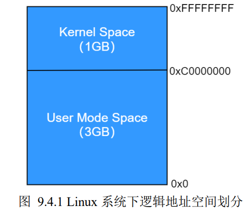

# Linux 应用开发

### 库函数
- 在 Linux 下，通常以动态（.so）
库文件的形式提供，存放在根文件系统/lib 目录下，C 语言库函数构建于系统调用之上
- 有些库函数并不调用任何系统调用,而有些库函数则会使用系统调用来完成相关操作
-  C 语言库函数的设计是为了提供比底层系统调用更为方便、更为好用、且更具有可移植性的调用接口

##### 库函数与系统调用的区别
1. 库函数是属于应用层，而系统调用是内核提供给应用层的编程接口，属于系统内核的一部分
2. 库函数运行在用户空间，调用系统调用会由用户空间（用户态）陷入到内核空间（内核态）
3. 库函数通常是有缓存的，而系统调用是无缓存的，所以在性能、效率上，库函数通常要优于系统调用
4. 可移植性：库函数相比于系统调用具有更好的可移植性，通常对于不同的操作系统，其内核向应用层提供的系统调用往往都是不同，譬如系统调用的定义、功能、参数列表、返回值等往往都是不一样的；而对于 C 语言库函数来说，由于很多操作系统都实现了 C 语言库，C 语言库在不同的操作系统之间其接口定义几乎是一样的，所以库函数在不同操作系统之间相比于系统调用具有更好的可移植性

********************************
# 文件IO
__*在Linux 系统下，绝大部分的函数都是返回 0 作为函数调用成功的标识、而返回负数（譬如-1）表示函数调用失败*__

### 文件描述符
**所有执行 IO 操作的系统调用都是通过`文件描述符`来索引到对应的文件**

-  Linux下一个进程最多可以打开**1024**个文件，这个限制数是可以设置的(可以通过`ulimit -n`来查看)。
-  文件描述符(fd)是从0开始的，一般都是从3开始的，因为0分配给了系统标准输入，1分配给标准输出，2分配给标准错误

### Linux 软链接与硬链接的区别
**inode**：是文件系统中存储文件元信息（文件的创建者、大小、日期等）的区域，称为节点索引

**软链接（soft link）**：也称为符号链接（Symbolic Link），类似于 Windows 操作系统中的快捷方式文件，该文件有自己的名称、inode 和 物理存储的文件数据（记录着另一文件的路径名指向），访问该文件会被重新定向到软链接所指的源文件名

**硬链接（hard link）**：相当于为当前文件名对应的文件再创建一个文件别名，当前文件名与该文件别名对应的 inode 和 物理存储的文件数据都是一样的，访问该文件别名同访问当前文件名一致


  

### 静态文件与inode
  1. *__硬盘的最小储存单位是扇区（Sector)(512字节），文件存取的最小单位是块，常见的是八个扇区组成一个块（4KB)__*
  2. *__磁盘在分区格式化的时候会分成两个区域：数据区存放数据，inode区存放inode table，且每个文件都有都有一个独一无二的inode(有一个相对应的数字编号)__*


  
  - 每一个文件都有唯一的一个 inode，每一个 inode 都有一个与之相对应的数字编号，通过这个数字编号就可以找到 inode table 中所对应的 inode
- 快速格式化只是删除了inode table，真正的存储文件数据没有动
- 打开一个文件，经历以下步骤：
  1. 找到文件对应的inode编号 
  2. 根据inode号在inode table中找到对应的inode结构体 
  3. 根据inode结构体对应的信息，确定文件数据所在的硬盘块区，读出数据

### 文件打开的状态
- open函数打开文件的时候，内核会申请一段内存（缓冲区），将静态文件的数据从磁盘读取到内存中进行操作（此时内存中的这份文件数据叫**动态文件、内核缓冲区**，磁盘中的数据为**静态文件**），打开文件后，对这个文件的读写操作都是针对内存中的这份文件进行操作
- 文件读取到内存中后，此时动态文件和静态文件就不同步了，同步工作由**内核**完成
- (磁盘操作）对文件中一个字节的修改也需要将字节所在的block全部读出来，修改后再写回磁盘中，读写不灵活；（内存操作）但是内存可以`按字节`为单位进行操作，可随机操作任意地址的数据，很灵活
- 内核缓冲区的设计目的是为了提高文件 I/O 的速度和效率，使得系统调用 read()、write()的操作更为快速，不需要等待磁盘操作（将数据写入到磁盘或从磁盘读取出数据），磁盘操作通常是比较缓慢的；同时也减少了内核操作磁盘的次数，因为如果没有内核缓冲区，每次write文件都会执行一次磁盘操作
  
### PCB（process control block)
  1. *__每个进程都有一个PCB来记录进程的状态信息等来管理进程__*
  2. *__PCB中有一个指针指向文件描述符表（File descritors),文件描述符表中的每个元素索引到对应的文件表（File table），文件表也是一个数据结构体，其中记录了很多文件相关的信息，譬如文件状态标志、引用计数、当前文件的读写偏移量及`i-node指针`（指向该文件对应的inode）等__*
  3. __文件描述符记录了这个进程打开了多少个文件以及文件的信息__
   


### 返回错误处理和errno
- __在 Linux 系统下对常见的错误做了一个编号，每一个编号都代表着每一种不同的错误类型，当函数执行发生错误的时候，操作系统会将这个错误所对应的编号赋值给 errno 变量，每一个进程（程序）都维护了自己的 errno 变量，它是程序中的全局变量，该变量用于存储就近发生的函数执行错误编号，也就意味着下一次的错误码会覆盖上一次的错误码__
- errno本质是一个int的全局变量，用来储存错误编号，但是不是所有系统调用或库函数出错时操作系统都会设置errno，这需要查man手册
- errno需要头文件errno.h


以下两个都是**C库函数**：<br/>
`strerror()`函数可以将对应的 errno 转换成适合我们查看的`字符串信息`,参数是`errno`

`perror()`函数来查看错误信息，一般用的最多的还是这个函数,调用此函数**不需要传入 errno，函数内部会自己去获取 errno 变量的值**，调用此函数会**直接将错误提示字符串打印出来，而不是返回字符串**，除此之外还可以在输出的错误提示字符串之前加入自己的打印信息,函数参数是加入自己的打印信息

### exit、_exit、_Exit函数
 __*在 Linux 系统下，进程正常退出除了可以使用 return 之外，还可以使用 exit()、_exit()以及_Exit()*__

1. main 函数中使用 return 后返回，return 执行后把控制权交给调用函数，结束该进程。调用_exit()函数会清除其使用的内存空间，并销毁其在内核中的各种数据结构，关闭进程的所有文件描述符，并结束进程、将控制权交给操作系统，___Exit函数__ 和 __exit函数__ 功能一样
2. exit函数是标准库函数，_exit和_Exit是系统调用，执行exit()会执行一些清理工作，最后调用_exit()函数
3. 三种终止进程的方法：
   1. main中return
   2. 调用Linux系统调用_exit或_Exit函数
   3. 调用库函数exit（推荐）

### 空洞文件（hole file)
空洞文件是指在某一段连续字节空间中没有写入任何数据，形成了空洞；实际上空洞部分**不会占据任何物理空间**，直到某时刻对空洞部分写入数据时才会给它分配空间，但是空洞文件形成时，逻辑上文件的大小是包含了空洞部分的大小

### 多次打开同一个文件
- 一个进程内多次 open 打开同一个文件，那么会得到多个不同的文件描述符 fd，同理在关闭文件的时候也需要调用 close 依次关闭各个文件描述符
- 一个进程内多次 open 打开同一个文件，在内存中并不会存在多份动态文件
- 一个进程内多次 open 打开同一个文件，不同文件描述符所对应的读写位置偏移量是相互独立的
   1. 同一个文件被多次打开，会得到多个不同的文件描述符，也就意味着会有多个不同的文件表，而文件读写偏移量信息就记录在文件表数据结构中，所以从这里可以推测不同的文件描述符所对应的读写偏移量是相互独立的，并没有关联在一起，并且文件表中 i-node 指针指向的都是同一个inode
   
   

- 动态文件何时被关闭呢？当文件的引用计数为 0 时，系统会自动将其关闭，同一个文件被打开多次，文件表中会记录该文件的引用计数
  

### 复制文件描述符(通过dup、dup2函数)
*__复制得到的文件描述符和旧的都指向同一个文件表，权限相同__(两个文件描述符的属性是一样，譬如对文件的读写权限、文件状态标志、文件偏移量等，所以从这里也可知道“复制”的含义实则是复制文件表)*


### 文件共享
*__文件共享指的是同一个文件（譬如磁盘上的同一个文件，对应同一个 inode）被多个独立的读写体同时进行 IO 操作__*

文件共享的核心：如何制造出多个不同的文件描述符来指向同一个文件

- 常见三种实现方式：
1. 同一个进程中多次调用 open 函数打开同一个文件


多次调用 open 函数打开同一个文件会得到多个不同的文件描述符，并且多个文件描述符对应多个不同的文件表，所有的文件表都索引到了同一inode 节点，也就是磁盘上的同一个文件

2. 不同进程中分别使用 open 函数打开同一个文件
   


各自的文件表都索引到了同一个 inode 节点，从而实现共享文件

3. 同一个进程中通过 dup（dup2）函数对文件描述符进行复制


#### fcntl函数
fcntl()函数可以对一个已经打开的文件描述符执行一系列控制操作，譬如复制一个文件描述符（与 dup、
dup2 作用相同）、获取/设置文件描述符标志、获取/设置文件状态标志等，类似于一个多功能文件描述符管
理工具箱。

### 截断文件
使用系统调用 `truncate()`或 `ftruncate()`可将普通文件截断为指定字节长度
```
#include <sys/types.h>
int truncate(const char *path, off_t length);
int ftruncate(int fd, off_t length);
```

这两个函数的区别在于：`ftruncate()`使用`文件描述符 fd 来指定目标文件`，而 `truncate()`则`直接使用文件路径 path 来指定目标文件`，其功能一样。这两个函数都可以对文件进行截断操作，将文件截断为参数 length 指定的字节长度，什么是截断？如果文件目前的大小大于参数 length 所指定的大小，则多余的数据将被丢失，类似于多余的部分被“砍”掉了；如果文件目前的大小小于参数 length 所指定的大小，则将其进行扩展，对扩展部分进行读取将得到空字
节"\0"。使用 ftruncate()函数进行文件截断操作之前，必须调用 open()函数打开该文件得到文件描述符，并且必须要具有可写权限，也就是调用 open()打开文件时需要指定 O_WRONLY 或 O_RDWR。
调用这两个函数并不会导致文件读写位置偏移量发生改变，所以截断之后一般需要重新设置文件当前的读写位置偏移量，以免由于之前所指向的位置已经不存在而发生错误（譬如文件长度变短了，文件当前所指向的读写位置已不存在）。调用成功返回 0，失败将返回-1，并设置 errno 以指示错误原因

********************************
# 标准IO库
*当使用标准IO库函数打开或创建一个文件的时候，会返回一个指向FILE类型对象读指针（FILE\*),使用该 FILE 指针与被打开或创建的文件相关联，然后该 FILE 指针就用于后续的标准 I/O 操作（使用标准 I/O 库函数进行 I/O 操作)* __(FILE 指针的作用相当于文件描述符，只不过 FILE 指针用于标准 I/O 库函数中、而文件描述符则用于文件I/O 系统调用中)__
- FILE数据结构定义于在stdio.h中

### 标准输入、输出和标准错误
- 每个进程启动之后都会默认打开标准输入、标准输出以及标准错误
- 在应用编程中可以使用宏 STDIN_FILENO、
STDOUT_FILENO 和 STDERR_FILENO 分别代表 0、1、2(文件描述符），这些宏定义在 unistd.h 头文件中，如下：
```
#define STDIN_FILENO 0 /* Standard input. */
#define STDOUT_FILENO 1 /* Standard output. */
#define STDERR_FILENO 2 /* Standard error output. */
```
标准库函数的标准IO定义是(标准IO中是无法用文件描述符来对文件进行IO操作）：
```
/* Standard streams. */
extern struct _IO_FILE *stdin; /* Standard input stream. */
extern struct _IO_FILE *stdout; /* Standard output stream. */ //struct _IO_FILE 结构体就是 FILE 结构体，使用了 typedef 进行了重命名
extern struct _IO_FILE *stderr; /* Standard error output stream. */
/* C89/C99 say they're macros. Make them happy. */
#define stdin stdin
#define stdout stdout
#define stderr stderr
```

### 格式控制字符串
格式控制字符串由两个部分组成：普通字符（非%字符）和转换说明

`%[flags][width][.precision][length]type`

type和%是必须的，常用的type有：
1. `%d`: int类型（十进制）
2. `%x`: unsigned int(无符号十六进制)
3. `%o`: unsigned int(无符号八进制)
4. `%e`: double(浮点数)
5. `%s`: string(字符串)


### 刷新文件IO的内核缓冲区

IO的内核缓冲区：内核会从磁盘设备中读取文件的数据并存储到内核的缓冲区中，当调用 read()函数读取数据时，read()调用将从内核缓冲区中读取数据，直至把缓冲区中的数据读完，这时，内核会将文件的下一段内容读入到内核缓冲区中进行缓存。`内核缓冲区就称为文件 I/O 的内核缓冲`。这样的设计，目的是为了提高文件 I/O 的速度和效率，使得系统调用 read()、write()的操作更为快速，不需要等待磁盘操作（将数据写入到磁盘或从磁盘读取出数据），磁盘操作通常是比较缓慢的

当调用 write()之后，内核稍后会将数据写入到磁盘设备中，具体是什么时间点写入到磁盘，这个其实是不确定的，由内核根据相应的存储算法自动判断

__强制将文件 I/O 内核缓冲区中缓存的数据写入（刷新）到磁盘设备中，对于某些应用程序来说，可能是很有必要的,因为有些操作需要确保前面操作的数据已经真正存入到磁盘中__

`元数据并不是文件内容本身的数据，而是一些用于记录文件属性相关的数据信息，譬如文件大小、时间戳、权限等等信息，这里统称为文件的元数据`

1. `fsync函数` ： `int fsync(int fd)` 系统调用 fsync()将参数 fd 所指文件的`内容数据`和`元数据`写入磁盘，只有在对磁盘设备的写入操作完成之后，fsync()函数才会返回
2. `fdatasync函数` : `int fdatasync(int fd)` 系统调用 fdatasync()与 fsync()类似，不同之处在于 fdatasync()仅将参数 fd `所指文件的内容数据写入磁盘，并不包括文件的元数据`；同样，只有在对磁盘设备的写入操作完成之后，fdatasync()函数才会返回
3. `sync函数` : `void sync(void)` 系统调用 sync()会将`所有文件` I/O 内核缓冲区中的文件内容数据和元数据全部更新到磁盘设备中，该函数没有参数、也无返回值，意味着它不是对某一个指定的文件进行数据更新，而是`刷新所有文件 I/O 内核缓冲区`。
   
#### 控制文件IO内核缓冲标志
1. 调用open函数时，指定O_DSYNC标志则会类似在每个write函数后调用fdatasync函数进行数据同步
2. O_SYNC标志使得每个write()调用都会自动将文件内容数据和元数据刷新到磁盘设备中，其效果类似于在每个 write()调用之后调用 fsync()函数进行数据同步
3. 需要注意的是，在程序中频繁调用 fsync()、fdatasync()、sync()（或者调用 open 时指定 O_DSYNC 或 O_SYNC 标志）对性能的影响极大（因为是系统调用），大部分的应用程序是没有这种需求的，所以在大部分应用程序当中基本不会使用到


#### 直接IO：绕过内核缓冲
__Linux 2.4开始允许执行IO文件直接绕过内核缓冲区，从用户空间直接传递到文件或磁盘，称为直接IO（direct IO)或裸IO(raw IO)__

- open函数中的O_DIRECT标志就可以实现直接IO
- 直接IO的对齐限制：
  1. 应用程序中用于存放数据的缓冲区，其内存起始地址必须以块（磁盘物理块）大小的整数倍进行对齐
  2. 写文件时，文件的位置偏移量必须是块大小的整数倍
  3. 写入到文件的数据大小必须是块大小的整数倍

#### stdio缓冲

**标准 I/O（fopen、fread、fwrite、fclose、fseek 等）是 `C 语言标准库函数`，而文件 I/O（open、read、write、close、lseek 等）是`系统调用`，虽然标准 I/O 是在文件 I/O 基础上进行封装而实现（譬如 fopen 内部实际上调用了 open、fread 内部调用了 read 等），`但在效率、性能上标准 I/O 要优于文件 I/O`，其原因在于标准 I/O 实现维护了自己的缓冲区，我们把这个缓冲区称为 `stdio 缓冲区`**

  *__标准IO所维护的stdio缓冲是`用户空间`的，而文件IO缓冲是`内核维护`的__*
  
  - 当应用程序中通过标准 I/O 操作磁盘文件时，为了减少调用系统调用的次数，标准 I/O 函数会将用户写入或读取文件的数据缓存在 stdio 缓冲区，然后再一次性将 stdio 缓冲区中缓存的数据通过调用系统调用 I/O（文件 I/O）写入到文件 I/O 内核缓冲区或者拷贝到应用程序的 buf 中,这样可以减少系统调用的次数，提高效率和性能

#### 刷新stdio缓冲区
无论我们采取何种缓冲模式，在任何时候都可以使用库函数 `fflush()`来强制刷新（将输出到 stdio 缓冲区中的数据写入到内核缓冲区，通过 write()函数）stdio 缓冲区，该函数会刷新指定文件的 stdio 输出缓冲区

printf()输出的字符串写入到了标准输出的 stdio 缓冲区中，只有输出换行符时（不考虑缓冲区填满的情况）才会将这一行数据刷入到内核缓冲区，也就是写入标准输出文件（终端设备）

```
#include <stdio.h>
int fflush(FILE *stream);
//参数 stream 指定需要进行强制刷新的文件，如果该参数设置为 NULL，则表示刷新所有的 stdio 缓冲区。函数调用成功返回 0，否则将返回-1，并设置 errno 以指示错误原因
```

关于刷新 stdio 缓冲区相关内容，最后进行一个总结：<br/>
⚫ 调用 fflush()库函数可强制刷新指定文件的 stdio 缓冲区；<br/>
⚫ 调用 fclose()关闭文件时会自动刷新文件的 stdio 缓冲区；
<br/>
⚫ 程序退出时会自动刷新 stdio 缓冲区（注意区分不同的情况）。

<br/>


### 文件描述符与 FILE 指针互转
在应用程序中，在同一个文件上执行 I/O 操作时，还可以将文件 I/O（系统调用 I/O）与标准 I/O 混合使用，这个时候我们就需要将文件描述符和 FILE 指针对象之间进行转换，此时可以借助于库函数 `fdopen()`、`fileno()`来完成。

库函数 `fileno()`可以将标准 I/O 中使用的 FILE 指针转换为文件 I/O 中所使用的文件描述符，而 `fdopen()`则进行着相反的操作
**************************************
# 文件属性与目录

__Linux系统一共分为7种文件类型__
1. __普通文件__：`'-'`(字符表示)


    __*普通文件分为文本文件和二进制文件*__
   - 文件中的内容是由文本构成的，所谓文本指的是 `ASCII码`字符。文件中的内容其本质上都是数字（因为计算机本身只有 0 和 1，存储在磁盘上的文件内容也都是由 0 和 1 所构成），而文本文件中的数字应该被理解为这个数字所对应的 ASCII 字符码；譬如常见的.c、.h、.sh、.txt 等这些都是文本文件，文本文件的好处就是方便人阅读、浏览以及编写
   - 二进制文件中存储的本质上也是数字，只不过对于二进制文件来说，这些数字并不是文本字符编码，而是真正的数字。譬如 Linux 系统下的可执行文件、C 代码编译之后得到的.o 文件、.bin 文件等都是二进制文件
2. __目录文件__：`'d'`
3. __字符设备文件__：`'c'`

   - 设备文件并不对应磁盘上的一个文件，也就是说设备文件并不存在于磁盘中，而是由文件系统虚拟出来的，一般是由内存来维护，当系统关机时，设备文件都会消失；字符设备文件一般存放在 Linux 系统/dev/目录下，所以/dev 也称为虚拟文件系统 devfs
4. __块设备文件__：`'b'`
5. __符号链接文件__：`'l'`

   - 符号链接文件（link）类似于 Windows 系统中的快捷方式文件，是一种特殊文件，它的内容指向的是另一个文件路径，当对符号链接文件进行操作时，系统根据情况会对这个操作转移到它指向的文件上去，而不是对它本身进行操作
6. __套接字文件__：`'s'`
7. __管道文件__：`'p'`


__Linux下的stat命令实际上是调用stat系统调用函数来实现的__

### stat函数
```
#include <sys/types.h>
#include <sys/stat.h>
#include <unistd.h>
int stat(const char *pathname, struct stat *buf);  //pathname是指定的文件路径，buf是指向struct stat结构体变量的指针，将获取到的文件stat放到结构体中
```

__stat结构体__
```
struct stat
{
 dev_t st_dev; /* 文件所在设备的 ID */
 ino_t st_ino; /* 文件对应 inode 节点编号 */
 mode_t st_mode; /* 文件对应的模式,即文件的类型、权限等 */
 nlink_t st_nlink; /* 文件的链接数 */
 uid_t st_uid; /* 文件所有者的用户 ID */
 gid_t st_gid; /* 文件所有者的组 ID */
 dev_t st_rdev; /* 设备号（指针对设备文件） */
 off_t st_size; /* 文件大小（以字节为单位） */
 blksize_t st_blksize; /* 文件内容存储的块大小 */
 blkcnt_t st_blocks; /* 文件内容所占块数 */
 struct timespec st_atim; /* 文件最后被访问的时间 */
 struct timespec st_mtim; /* 文件内容最后被修改的时间 */
 struct timespec st_ctim; /* 文件状态最后被改变的时间 */
};

//struct timespec 结构体定义在time.h头文件中，是 Linux 系统中时间相关的结构体

struct timespec
{
 time_t tv_sec; /* 秒 */  //time_t是long int 类型
 syscall_slong_t tv_nsec; /* 纳秒 */
};
```

### fstat和lstat函数
fstat和lstat函数和stat作用一样，但是参数细节等方面有不同
- __stat函数是从文件名出发得到文件属性信息，不需要先打开文件；而 fstat 函数则是从文件描述符出发得到文件属性信息，所以使用 fstat 函数之前需要先打开文件得到文件描述符。如果并不想通过打开文件来得到文件属性信息，那么就使用stat，如果文件已经打开了，那么就使用fstat函数__

`stat函数`
```
#include <sys/types.h>
#include <sys/stat.h>
#include <unistd.h>

int fstat(int fd, struct stat *buf); //fd表示文件描述符，第二个参数以及返回值与 stat 一样
```
`lstat函数`
- lstat()与 stat、fstat 的区别在于，对于符号链接文件，stat、fstat 查阅的是符号链接文件所指向的文件对应的文件属性信息，而 lstat 查阅的是符号链接文件本身的属性信息

```
#include <sys/types.h>
#include <sys/stat.h>
#include <unistd.h>

int lstat(const char *pathname, struct stat *buf); //和stat函数一样
```
<br/>
<br/>

****************************************

# 信号
__信号是事件发生时对进程的通知机制，也可以把它称为`软件中断`__

`信号是异步的`

### 进程对信号的处理
进程对接受到的信号有三种不同的处理方式：1.忽略信号 2.捕获信号 3.执行系统默认操作

__Linux中提供了`signal函数`和`sigaction函数`来设置信号的处理方式__

##### `signal 函数`

```
#include <signal.h> //需要包含此头文件
typedef void (*sig_t)(int);
sig_t signal(int signum, sig_t handler); //signum是需要设置的信号，建议使用信号名字（也可以用数字编号），handle是指向信号对应的信号处理函数，接受到信号后自动执行处理函数
//函数执行成功则返回指向信号处理函数的指针，否则返回SIG_ERR
```

##### 两种不同状态下的信号处理方式
1. 当程序刚启动时，进程默认对所以信号的处理方式都是系统默认操作
2. 当进程调用fork函数创建子进程时，子进程也会继承父进程的信号处理方式

##### `sigaction函数`（推荐使用）

```
#include <signal.h>
int sigaction(int signum, const struct sigaction *act, struct sigaction *oldact); //signum同是需要设置的信号，act是一个struct sigaction 类型指针，指向一个 struct sigaction 数据结构，该数据结构描述了信号的处理方式，oldact 参数也是一个 struct sigaction 类型指针，指向一个 struct sigaction 数据结构。如果参数
oldact 不为 NULL，则会将信号之前的处理方式等信息通过参数 oldact 返回出来；如果无意获取此类信息，那么可将该参数设置为 NULL
```

__struct sigaction结构体__
```
struct sigaction {
 void (*sa_handler)(int); //信号处理函数
 void (*sa_sigaction)(int, siginfo_t *, void *);也是一个信号处理函数，提供更多参数
 sigset_t sa_mask;
 int sa_flags;
 void (*sa_restorer)(void);
};

```

__*一般来说，信号处理函数设计越简单越好，这一个重要的原因在于，设计的越简单这将降低引发信号竞争条件的风险*__

### 向进程发送信号

#### `kill函数`
一个进程可以通过`kill函数`向另外一个进程发送信号

```
#include <sys/types.h>
#include <signal.h>

int kill(pid_t pid, int sig);  //进程pid,sig是需要发送的信号

//
如果 pid 为正，则信号 sig 将发送到 pid 指定的进程。
如果 pid 等于 0，则将 sig 发送到当前进程的进程组中的每个进程。
如果 pid 等于-1，则将 sig 发送到当前进程有权发送信号的每个进程，但进程 1（init）除外。
如果 pid 小于-1，则将 sig 发送到 ID 为-pid 的进程组中的每个进程
```
__进程中将信号发送给另一个进程是需要权限的，并不是可以随便给任何一个进程发送信号，超级用户root 进程可以将信号发送给任何进程，但对于非超级用户（普通用户）进程来说，其基本规则是发送者进程的实际用户 ID 或有效用户 ID 必须等于接收者进程的实际用户 ID 或有效用户 ID__


#### `raise函数`
```
#include <signal.h>
int raise(int sig); //sig为需要发送的信号
```
`raise函数`其实等价于`kill(getpid()),sig)`


#### 'alarm函数'
使用 alarm()函数可以设置一个定时器（闹钟），当定时器定时时间到时，内核会向进程发送 `SIGALRM信号`
```
#include <unistd.h>
unsigned int alarm(unsigned int seconds); //seconds是以秒为单位的定时时间，如果为0，则表示取消之前设置的alarm闹钟
//返回值：如果在调用 alarm()时，之前已经为该进程设置了 alarm 闹钟还没有超时，则该闹钟的剩余值作
为本次 alarm()函数调用的返回值，之前设置的闹钟则被新的替代；否则返回 0
//需要注意的是 alarm 闹钟并不能循环触发，只能触发一次，若想要实现循环触发，可以在 SIGALRM 信
号处理函数中再次调用 alarm()函数设置定时器
```

#### `pause函数`
`pause()`系统调用可以使得进程暂停运行、进入休眠状态，直到进程捕获到一个信号为止，只有执行了信号处理函数并从其返回时，pause()才返回，在这种情况下，pause()返回-1，并且将 errno 设置为 EINTR
```
#include <unistd.h>
int pause(void);
```


### 信号集
__通常我们需要有一个能表示多个信号（一组信号）的数据类型---信号集（signalset）__

信号集其实就是sigset_t类型的数据结构，使用这个结构体可以表示一组信号，将多个信号添加到该数据结构中
```
# define _SIGSET_NWORDS (1024 / (8 * sizeof (unsigned long int)))
typedef struct
{
  unsigned long int __val[_SIGSET_NWORDS];
} sigset_t;
```
__Linux提供了诸如`sigemptyset`,`sigfillset`,`sigaddset`,`sigdelset`,`sigismember`等信号集的API__

...待

******************************
# 进程

1. 操作系统下的应用程序在运行 `main()`函数之前需要先执行一段`引导代码`，最终由这段引导代码去调用应用程序的 main()函数。在编译链接时，由链接器将引导代码链接到我们的应用程序当中，一起构成最终的可执行文件
2. 程序运行需要通过操作系统的`加载器`来实现，加载器是操作系统中的程序，当执行程序时，加载器负责将此应用程序加载内存中去执行
3. 命令行参数（command-line argument）由 shell 进程逐一进行解析，shell 进程会将这些参数传递给加载器，加载器加载应用程序时会将其传递给应用程序引导代码，当引导程序调用 main()函数时，在由它最终传递给 main()函数
4. 程序结束分为正常终止和异常终止： 
   1. main()函数中通过 return 语句返回来终止进程 
   2.  应用程序中调用 exit()函数终止进程
   3.  应用程序中调用_exit()或_Exit()终止进程
   4.  应用程序中调用 abort()函数终止进程（异常终止）
   5.  进程接收到一个信号，譬如 SIGKILL 信号（异常终止）

### 进程的环境变量
每一个进程都有一组与其相关的环境变量，这些环境变量以字符串形式存储在一个字符串数组列表中，把这个数组称为环境列表，且都是键值对，在Linux环境下可以使用`env`指令来查看环境变量，也可以使用`export`指令来新增键值对（加上`-n`就是删除键值对）

在我们的应用程序当中也可以获取当前进程的环境变量，事实上，进程的环境变量是从其父进程中继承
过来的，譬如在 shell 终端下执行一个应用程序，那么该进程的环境变量就是从其父进程（shell 进程）中继
承过来的。新的进程在创建之前，会继承其父进程的环境变量副本

环境变量存放在一个字符串数组中，在应用程序中，通过 environ 变量指向它，environ 是一个全局变量，在我们的应用程序中只需申明它即可使用
```
extern char** environ;
```


**Linux 下的 size 命令可以查看二进制可执行文件的文本段、数据段、bss 段的段大小**


### 进程的虚拟地址空间

在 Linux 系统中，每一个进程都在自己独立的地址空间中运行，在 32 位系统中，每个进程的逻辑地址空间均为 4GB，这 4GB 的内存空间按照 3:1 的比例进行分配，其中用户进程享有 3G 的空间，而内核独自享有剩下的 1G 空间



**为什么要引入虚拟地址空间呢？**
如果操作系统没有虚拟地址机制，所有的应用程序访问的内存地址就是实际的物理地址，所以要将所有应用程序加载到内存中，但是我
们实际的物理内存只有 4G，所以就会出现一些问题：
- 当多个程序需要运行时，必须保证这些程序用到的内存总量要小于计算机实际的物理内存的大小。
- **内存使用效率低**。内存空间不足时，就需要将其它程序暂时拷贝到硬盘中，然后将新的程序装入内存。然而由于大量的数据装入装出，内存的使用效率就会非常低
- **进程地址空间不隔离**。由于程序是直接访问物理内存的，所以每一个进程都可以修改其它进程的内存数据，甚至修改内核地址空间中的数据，所以有些恶意程序可以随意修改别的进程，就会造成一些破坏，系统不安全、不稳定
- **无法确定程序的链接地址**。程序运行时，链接地址和运行地址必须一致，否则程序无法运行！因为程序代码加载到内存的地址是由系统随机分配的，是无法预知的，所以程序的运行地址在编译程序
时是无法确认的

针对以上的一些问题，就引入了虚拟地址机制，程序访问存储器所使用的逻辑地址就是虚拟地址，通过逻辑地址映射到真正的物理内存上。所有应用程序运行在自己的虚拟地址空间中，使得进程的虚拟地址空间和物理地址空间隔离开来，这样做带来了很多的优点：
- 进程与进程、进程与内核相互隔离。一个进程不能读取或修改另一个进程或内核的内存数据，这是因为每一个进程的虚拟地址空间映射到了不同的物理地址空间。提高了系统的安全性与稳定性
- 在某些应用场合下，两个或者更多进程能够共享内存。因为每个进程都有自己的映射表，可以让不同进程的虚拟地址空间映射到相同的物理地址空间中。通常，共享内存可用于实现进程间通信
- 便于实现内存保护机制。譬如在多个进程共享内存时，允许每个进程对内存采取不同的保护措施，例如，一个进程可能以只读方式访问内存，而另一进程则能够以可读可写的方式访问
- 编译应用程序时，无需关心链接地址。前面提到了，当程序运行时，要求链接地址与运行地址一致，在引入了虚拟地址机制后，便无需关心这个问题


**fork()调用成功后，子进程和父进程会继续执行 fork()调用之后的指令，子进程、父进程各自在自己的进程空间中运行。事实上，子进程是父进程的一个`副本`，譬如子进程拷贝了父进程的数据段、堆、栈以及继承了父进程打开的文件描述符，父进程与子进程并不共享这些存储空间，这是子进程对父进程相应部分存储空间的完全复制，执行 fork()之后，每个进程均可修改各自的栈数据以及堆段中的变量，而并不影响另一个进程。虽然子进程是父进程的一个副本，但是对于程序代码段（文本段）来说，两个进程执行相同的代码段，
因为代码段是只读的，也就是说父子进程共享代码段，在内存中只存在一份代码段数据**


### 父、子进程间的文件共享
调用 fork()函数之后，子进程会获得父进程所有文件描述符的副本，这些副本的创建方式类似于 dup()，这也意味着父、子进程对应的文件描述符均指向相同的文件表


由此可知，子进程拷贝了父进程的文件描述符表，使得父、子进程中对应的文件描述符指向了相同的文件表，也意味着父、子进程中对应的文件描述符指向了磁盘中相同的文件，因而这些文件在父、子进程间实现了共享，譬如，如果子进程更新了文件偏移量，那么这个改变也会影响到父进程中相应文件描述符的位置偏移量

由此可以看出，使用 fork()系统调用的代价是很大的，它复制了父进程中的数据段和堆栈段中的绝大部分内容，这将会消耗比较多的时间，效率会有所降低，而且太浪费，原因有很多，其中之一在于，fork()函数之后子进程通常会调用 exec 函数，也就是 fork()第二种使用场景下，这使得子进程不再执行父程序中的代码段，而是执行新程序的代码段，从新程序的 main 函数开始执行、并为新程序重新初始化其数据段、堆段、栈段等；那么在这种情况下，子进程并不需要用到父进程的数据段、堆段、栈段（譬如父程序中定义的局部变量、全局变量等）中的数据，此时就会导致浪费时间、效率降低


### 监视子进程

`wait函数`
```
#include <sys/types.h>
#include <sys/wait.h>
pid_t wait(int *status);
//status：参数 status 用于存放子进程终止时的状态信息，参数 status 可以为 NULL，表示不接收子进程终止时的状态信息
//返回值：若成功则返回终止的子进程对应的进程号；失败则返回-1。
```

- 调用 wait()函数，如果其所有子进程都还在运行，则 wait()会一直阻塞等待，直到某一个子进程终止
- 如果进程调用 wait()，但是该进程并没有子进程，也就意味着该进程并没有需要等待的子进程，那么 wait()将返回错误，也就是返回-1、并且会将 errno 设置为 ECHILD
- 如果进程调用 wait()之前，它的子进程当中已经有一个或多个子进程已经终止了，那么调用 wait()也不会阻塞。wait()函数的作用除了获取子进程的终止状态信息之外，**更重要的一点，就是回收子进程的一些资源，俗称为子进程“收尸”**。所以在调用 wait()函数之前，已经有子进程终止了，意味着正等待着父进程为其“收尸”，所以调用 wait()将不会阻塞，而是会立即替该子进程“收尸”、处理它的“后事”，然后返回到正常的程序流程中，一次 wait()调用只能处理一次


`waitpid函数`

使用 wait()系统调用存在着一些限制，这些限制包括如下：
- 如果父进程创建了多个子进程，使用 wait()将无法等待某个特定的子进程的完成，只能按照顺序等待下一个子进程的终止，一个一个来、谁先终止就先处理谁
- 如果子进程没有终止，正在运行，那么 wait()总是保持阻塞，有时我们希望执行非阻塞等待，是否有子进程终止，通过判断即可得知
- 使用 wait()只能发现那些被终止的子进程，对于子进程因某个信号（譬如 SIGSTOP 信号）而停止（注意，这里停止指的暂停运行），或是已停止的子进程收到 SIGCONT 信号后恢复执行的情况就无能为力了

`waitpid函数`可以突破这些限制
```
#include <sys/types.h>
#include <sys/wait.h>
pid_t waitpid(pid_t pid, int *status, int options);

//pid：参数 pid 用于表示需要等待的某个具体子进程，关于参数 pid 的取值范围如下：
⚫ 如果 pid 大于 0，表示等待进程号为 pid 的子进程；
⚫ 如果 pid 等于 0，则等待与调用进程（父进程）同一个进程组的所有子进程；
⚫ 如果 pid 小于-1，则会等待进程组标识符与 pid 绝对值相等的所有子进程；
⚫ 如果 pid 等于-1，则等待任意子进程。wait(&status)与 waitpid(-1, &status, 0)等价。

//status：与 wait()函数的 status 参数意义相同
//返回值：返回值与 wait()函数的返回值意义基本相同，在参数 options 包含了 WNOHANG 标志的情况下，返回值会出现 0
```

### 孤儿进程与僵尸进程
#### 孤儿进程
父进程先于子进程结束，也就是意味着，此时子进程变成了一个“孤儿”，我们把这种进程就称为孤儿进程。在 Linux 系统当中，所有的孤儿进程都自动成为` init 进程`（进程号为 1）的子进程，换言之，某一子进程的父进程结束后，该子进程调用 `getppid()`将返回 1，init 进程变成了孤儿进程的“养父”；这是判定某一子进程的“生父”是否还“在世”的方法之一

在ubuntu上孤儿进程的父进程不是init(pid=1)，而是upstart进程。事实上，/sbin/upstart 进程与 Ubuntu 系统图形化界面有关系，是图形化界面下的一个后台守护进程，可负责“收养”孤儿进程，所以图形化界面下，upstart 进程就自动成为了孤儿进程的父进程。但是可以通过按 `Ctrl + Alt + F7`让孤儿进程的父进程变成init，按原键即可退出

#### 僵尸进程
进程结束之后，通常需要其父进程为其“收尸”，回收子进程占用的一些内存资源，父进程通过调用wait()（或其变体 waitpid()、waitid()等）函数回收子进程资源，归还给系统

如果父进程创建了某一子进程，子进程已经结束，而父进程还在正常运行，但父进程并未调用 wait()回收子进程，此时子进程变成一个僵尸进程。首先来说，这样的程序设计是有问题的，如果系统中存在大量的僵尸进程，它们势必会填满内核进程表，从而阻碍新进程的创建。需要注意的是，僵尸进程是无法通过信号将其杀死的，即使是“一击必杀”信号 SIGKILL 也无法将其杀死，那么这种情况下，只能杀死僵尸进程的父进程（或等待其父进程终止），这样 init 进程将会接管这些僵尸进程，从而将它们从系统中清理掉！所以，
在我们的一个程序设计中，一定要监视子进程的状态变化，如果子进程终止了，要调用 wait()将其回收，避免僵尸进程


#### SIGCHLD信号
当发生以下两种情况时，父进程会收到该信号：
- 当父进程的某个子进程终止时，父进程会收到 SIGCHLD 信号
- 当父进程的某个子进程因收到信号而停止（暂停运行）或恢复时，内核也可能向父进程发送该信号

子进程的终止属于异步事件，父进程事先是无法预知的，如果父进程有自己需要做的事情，它不能一直wait()阻塞等待子进程终止（或轮训），这样父进程将啥事也做不了，那么有什么办法来解决这样的尴尬情况，当然有办法，那就是通过 SIGCHLD 信号。那既然子进程状态改变时（终止、暂停或恢复），父进程会收到 SIGCHLD 信号，SIGCHLD 信号的系统默认处理方式是将其忽略，所以我们要捕获它、绑定信号处理函数，在信号处理函数中调用 wait()收回子
进程，回收完毕之后再回到父进程自己的工作流程中

### 执行新进程

#### execve()函数
`系统调用`execve()可以将新程序加载到某一进程的内存空间，通过调用 execve()函数将一个`外部的可执行文件`(这个可执行文件就是gcc最后一步生成的二进制执行代码文件）加载到进程的内存空间运行，使用新的程序替换旧的程序，而进程的栈、数据、以及堆数据会被新程序的相应部件所替换，然后从新程序的 main()函数开始执行

```
#include <unistd.h>
int execve(const char *filename, char *const argv[], char *const envp[]);
//参数 filename 指向需要载入当前进程空间的新程序的路径名，既可以是绝对路径、也可以是相对路径
//argv：参数 argv 则指定了传递给新程序的命令行参数。是一个字符串数组，该数组对应于 main(int argc, char *argv[])函数的第二个参数 argv，且格式也与之相同，是由字符串指针所组成的数组，以 NULL 结束。argv[0]对应的便是新程序自身路径名
//envp：参数 envp 也是一个字符串指针数组，指定了新程序的环境变量列表，参数 envp 其实对应于新程序的 environ 数组，同样也是以 NULL 结束，所指向的字符串格式为 name=value
//返回值：execve 调用成功将不会返回；失败将返回-1，并设置 errno
```

#### system函数
使用 `system()函数`可以很方便地在我们的程序当中执行任意 `shell` 命令
```
#include <stdlib.h>
int system(const char *command);
//参数 command 指向需要执行的 shell 命令，以字符串的形式提供，譬如"ls -al"、
```
*__system()函数其内部的是通过调用 `fork()`、`execl()`以及 `waitpid()`这三个函数来实现它的功能，首先`system()`会调用 `fork()`创建一个子进程来运行 `shell`（可以把这个子进程成为 shell 进程），并通过 shell 执行参数command 所指定的命令__*


### 进程关系

1. **父子**
2. **无关系**
3. **进程组**：进程组是一个或多个进程的集合，这些进程并不是孤立的，它们彼此之间或者存在父子、兄弟关系，或者在功能上有联系。关于进程组需要注意以下以下内容：<br/>
    ⚫ 每个进程必定属于某一个进程组、且只能属于一个进程组；<br/>
    ⚫ 每一个进程组有一个组长进程，**组长进程的 ID 就等于进程组 ID**；<br/>
    ⚫ 在组长进程的 ID 前面加上一个负号即是操作进程组；<br/>
    ⚫ 组长进程不能再创建新的进程组；<br/>
    ⚫ 只要进程组中还存在一个进程，则该进程组就存在，这与其组长进程是否终止无关；<br/>
    ⚫ 一个进程组可以包含一个或多个进程，进程组的生命周期从被创建开始，到其内所有进程终止或离开该进程组；<br/>
    ⚫ 默认情况下，新创建的进程会继承父进程的进程组 ID<br/>

**通过系统调用 `getpgrp()`或 `getpgid()`可以获取进程对应的进程组 ID**
这两个函数都用于获取进程组 ID，getpgrp()没有参数，返回值总是调用者进程对应的进程组 ID；而对于 getpgid()函数来说，可通过参数 pid 指定获取对应进程的进程组 ID，如果参数 pid 为 0 表示获取调用者进程的进程组 ID

调用系统调用 setpgid()或 setpgrp()可以加入一个现有的进程组或创建一个新的进程组

4. **会话**：会话是一个或多个进程组的集合


-  一个会话可包含一个或多个进程组，但只能有一个前台进程组，其它的是后台进程组；每个会话都有一个会话首领（leader），即创建会话的进程。一个会话可以有控制终端、也可没有控制终端，在有控制终端的情况下也只能连接一个控制终端，这通常是登录到其上的终端设备（在终端登录情况下）或伪终端设备（譬如通过 SSH 协议网络登录），一个会话中的进程组可被分为一个前台进程组以及一个或多个后台进程组

- 会话的首领进程连接一个终端之后，该终端就成为会话的控制终端，与控制终端建立连接的会话首领进程被称为控制进程；产生在终端上的输入和信号将发送给会话的前台进程组中的所有进程，譬如 Ctrl + C（产生 SIGINT 信号）、Ctrl + Z（产生 SIGTSTP 信号）、Ctrl + \（产生 SIGQUIT 信号）等等这些由控制终端产生的信号
- 当用户在某个终端登录时，一个新的会话就开始了；当我们在 Linux 系统下打开了多个终端窗口时，实际上就是创建了多个终端会话

### 守护进程
**守护进程是运行在后台的一种特殊进程，它`独立于控制终端`并且`周期性地执行某种任务`或`等待处理某些事情的发生`，其特点是：**
- **长期运行**：守护进程是一种生存期很长的一种进程，它们一般在系统启动时开始运行，除非强行终止，否则直到系统关机都会保持运行
- **与控制终端脱离**：在 Linux 中，系统与用户交互的界面称为终端，每一个从终端开始运行的进程都会依附于这个终端，这是控制终端，也就是会话的控制终端。当控制终端被关闭的时候，该会话就会退出，由控制终端运行的所有进程都会被终止，这使得普通进程都是和运行该进程的终端相绑定的；但守护进程能突破这种限制，它脱离终端并且在后台运行，脱离终端的目的是为了避免进程在运行的过程中的信息在终端显示并且进程也不会被任何终端所产生的信息所打断

### 编写守护进程

1. **创建子进程、终止父进程**：父进程调用 fork()创建子进程，然后父进程使用 exit()退出
2. **子进程调用 setsid 创建会话**：由于之前子进程并不 是进程组的组长进程，所以调用 setsid()会使得子进程创建一个新的会话，子进程成为新会话的首领进程，同样也创建了新的进程组、子进程成为组长进程，此时创建的会话将没有控制终端。所以这里调用 setsid 有三个**作用**：让子进程摆脱原会话的控制、让子进程摆脱原进程组的控制和让子进程摆脱原控制终端的控制。在调用 fork 函数时，子进程继承了父进程的会话、进程组、控制终端等，虽然父进程退出了，但原先的会话期、进程组、控制终端等并没有改变，因此，那还不是真正意义上使两者独立开来。setsid 函数能够使子进程完全独立出来，从而脱离所有其他进程的控制
3. **将工作目录更改为根目录**：子进程是继承了父进程的当前工作目录，由于在进程运行中，当前目录所在的文件系统是不能卸载的，这对以后使用会造成很多的麻烦。因此通常的做法是让“/”作为守护进程的当前目录，当然也可以指定其它目录来作为守护进程的工作目录
4. **重设文件权限掩码 umask**:文件权限掩码 umask 用于对新建文件的权限位进行屏蔽。由于使用 fork 函数新建的子进程继承了父进程的文件权限掩码，这就给子进程使用文件带来了诸多的麻烦。因此，把文件权限掩码设置为 0，确保子进程有最大操作权限、这样可以大大增强该守护进程的灵活性。设置文件权限掩码的函数是 umask，通常的使用方法为 umask(0)。
5. **关闭不再需要的文件描述符**:子进程继承了父进程的所有文件描述符，这些被打开的文件可能永远不会被守护进程（此时守护进程指的就是子进程，父进程退出、子进程成为守护进程）读或写，但它们一样消耗系统资源，可能导致所在的文件系统无法卸载，所以必须关闭这些文件，这使得守护进程不再持有从其父进程继承过来的任何文件描述符
6. **将文件描述符号为 0、1、2 定位到/dev/null**：将守护进程的标准输入、标准输出以及标准错误重定向到/dev/null，这使得守护进程的输出无处显示、也无处从交互式用户那里接收输入
7. **其它：忽略 SIGCHLD 信号**：处理 SIGCHLD 信号不是必须的，但对于某些进程，特别是并发服务器进程往往是特别重要的，服务器进程在接收到客户端请求时会创建子进程去处理该请求，如果子进程结束之后，父进程没有去 wait 回收子进程，则子进程将成为僵尸进程；如果父进程 wait 等待子进程退出，将又会增加父进程的负担、也就是增加服务器的负担，影响服务器进程的并发性能，在 Linux 下，可以将 SIGCHLD 信号的处理方式设置为
SIG_IGN，也就是忽略该信号，可让内核将僵尸进程转交给 init 进程去处理，这样既不会产生僵尸进程、又省去了服务器进程回收子进程所占用的时间

#### SIGHUP 信号
当用户准备退出会话时，系统向该会话发出 SIGHUP 信号，会话将 SIGHUP 信号发送给所有子进程，子进程接收到 SIGHUP 信号后，便会自动终止，当所有会话中的所有进程都退出时，会话也就终止了；因为程序当中一般不会对 SIGHUP 信号进行处理，所以对应的处理方式为**系统默认方式**，SIGHUP 信号的系统默认处理方式便是终止进程。上面解释了，为什么子进程会随着会话的退出而退出，因为它收到了 SIGHUP 信号。不管是前台进程还是后台进程都会收到该信号

### 单例模式运行
**使用文件锁**：，当文件不存在则创建该文件，然后尝试去获取文件锁，若是成功，则将程序的进程号（PID）写入到该文件中，写入后不要关闭文件或解锁（释放文件锁），保证进程一直持有该文件锁；若是程序获取锁失败，代表程序已经被运行、则退出本次启动（**当程序退出或文件关闭之后，文件锁会自动解锁！**）

通常使用`系统调用flock()`，产生的是咨询锁（建议性锁）、并不能产生强制性锁

这种机制在一些程序尤其是服务器程序中很常见，服务器程序使用这种方法来保证程序的单例模式运行；在 Linux 系统中/var/run/目录下有很多以.pid 为后缀结尾的文件，这个实际上是为了保证程序以单例模式运行而设计的，作为程序实现单例模式运行所需的特定文件.这些以.pid 为后缀的文件，命名方式通常是程序名+.pid，譬如 acpid.pid 对应的程序便是 acpid、lightdm.pid对应的程序便是 lightdm 等等。如果我们要去实现一个以单例模式运行的程序，譬如一个守护进程，那么也应该将这个特定文件放置于 Linux 系统`/var/run/`目录下，并且文件的命名方式为 `name.pid`（name 表示进程名）


# 进程间通信

### 管道和FIFO
管道包含三种：
1. **普通管道 pipe**：通常有两种限制，一是`单工`，数据只能`单向传输`；二是只能在`父子或者兄弟进程间`使用
2. **流管道 s_pipe**：去除了普通管道的第一种限制，为`半双工`，可以双向传输；只能在`父子或兄弟进程`间使用
3. **有名管道 name_pipe（FIFO）**：去除了普通管道的第二种限制，并且允许在不相关（不是父子或兄弟关系）的进程间进行通讯

普通管道可用于具有亲缘关系的进程间通信，并且数据只能单向传输，如果要实现双向传输，则必须要使用两个管道；而流管道去除了普通管道的第一种限制，可以半双工的方式实现双向传输，但也只能在具有亲缘关系的进程间通信；而有名管道（FIFO）则同时突破了普通管道的两种限制，即可实现双向传输、又能在非亲缘关系的进程间通信

   

### 消息队列
消息队列是消息的`链表`，存放在`内核`中并由消息队列标识符标识，消息队列克服了信号传递信息少、管道只能承载无格式字节流以及缓冲区大小受限等缺陷。消息队列包括 `POSIX 消息队列`和 `System V 消息队列`

UNIX 允许不同进程将`格式化的数据流`以`消息队列`形式发送给任意进程，有足够权限的进程可以向队列中添加消息，被赋予读权限的进程则可以读走队列中的消息

### 信号（异步）

### 信号量
- 信号量是一个`计数器`，与其它进程间通信方式不大相同，它**主要用于控制多个进程间或一个进程内的多个线程间对共享资源的访问**，相当于内存中的标志，进程可以根据它判定是否能够访问某些共享资源，同时，进程也可以修改该标志，除了用于共享资源的访问控制外，还可用于`进程同步`。
- 它常作为一种`锁机制`，防止某进程在访问资源时其它进程也访问该资源，因此，主要作为进程间以及同一个进程内不同线程之间的同步手段。Linux 提供了一组精心设计的信号量接口来对信号量进行操作，它们
声明在头文件 sys/sem.h 中

### 共享内存
共享内存就是映射一段能被其它进程所访问的内存，这段共享内存由一个进程创建，但其它的多个进程都可以访问，使得多个进程可以访问同一块内存空间。共享内存是`最快`的 IPC 方式，它是针对其它进程间通信方式运行效率低而专门设计的，`它往往与其它通信机制，譬如结合信号量来使用`，以实现进程间的同步和通信

### Socket
Socket 是一种 IPC 方法，是基于网络的 IPC 方法，允许位于同一主机（计算机）或使用网络连接起来的不同主机上的应用程序之间交换数据，说白了就是网络通信(`是唯一能进行跨主机通信的方法`)


# 线程同步

__*线程同步是为了对共享资源的访问进行保护,保护的目的是为了解决数据一致性的问题,而出现数据一致性问题其本质在于进程中的多个线程对共享资源的并发访问（同时访问）*__

### 互斥锁
互斥锁（mutex）又叫互斥量，从本质上说是一把锁，在访问共享资源之前对互斥锁进行上锁，在访问完成后释放互斥锁（解锁）；对互斥锁进行上锁之后，任何其它试图再次对互斥锁进行加锁的线程都会被阻塞，直到当前线程释放互斥锁

互斥锁使用 `pthread_mutex_t` 数据类型表示，在使用互斥锁之前，必须首先对它进行初始化操作，可以使用`两种`方式对互斥锁进行初始化操作
1. **使用 PTHREAD_MUTEX_INITIALIZER 宏初始化互斥锁**:
互斥锁使用 pthread_mutex_t 数据类型表示， pthread_mutex_t 其实是一个结构体类型， 而宏`PTHREAD_MUTEX_INITIALIZER`其实是一个对结构体`赋值操作`的封装
```
# define PTHREAD_MUTEX_INITIALIZER \
 { { 0, 0, 0, 0, 0, __PTHREAD_SPINS, { 0, 0 } } }
```
`pthread_mutex_t mutex = PTHREAD_MUTEX_INITIALIZER;`

2. **使用 `pthread_mutex_init()`函数初始化互斥锁**:
使用 `PTHREAD_MUTEX_INITIALIZER `宏只适用于在`定义`的时候就直接进行初始化,对于其它情况则不能使用这种方式，譬如先定义互斥锁，后再进行初始化，或者在堆中动态分配的互斥锁，譬如使用 malloc()函数申请分配的互斥锁对象，那么在这些情况下，可以使用 `pthread_mutex_init()`函数对互斥锁进行初始化

#### 互斥锁加锁和解锁
互斥锁初始化之后，处于一个未锁定状态，调用函数 `pthread_mutex_lock()`可以对互斥锁加锁、获取互斥锁，而调用函数` pthread_mutex_unlock()`可以对互斥锁解锁、释放互斥锁

如果互斥锁处于未锁定状态，则此次调用会上锁成功，函数调用将立马返回；如果互斥锁此时已经被其它线程锁定了，那么调用 `pthread_mutex_lock()`会一直`阻塞`，直到该互斥锁被解锁，到那时，调用将锁定互斥锁并返回

##### **pthread_mutex_trylock()函数:**

当互斥锁已经被其它线程锁住时，调用 pthread_mutex_lock()函数会被阻塞，直到互斥锁解锁；如果线程不希望被阻塞，可以使用 pthread_mutex_trylock()函数；调用 pthread_mutex_trylock()函数尝试对互斥锁进行加锁，如果互斥锁处于未锁住状态，那么调用pthread_mutex_trylock()将会锁住互斥锁并立马返回，如果互斥锁已经被其它线程锁住，调用 pthread_mutex_trylock()加锁失败，`但不会阻塞`，而是返回错误码 EBUSY

**当不再需要互斥锁时，应该将其销毁，通过调用pthread_mutex_destroy()函数来销毁互斥锁**
- 不能销毁还没有解锁的互斥锁，否则将会出现错误
- 没有初始化的互斥锁也不能销毁
- 被 pthread_mutex_destroy()销毁之后的互斥锁，就不能再对它进行上锁和解锁了，需要再次调用pthread_mutex_init()对互斥锁进行初始化之后才能使用

### 条件变量
条件变量是线程可用的另一种同步机制。条件变量用于`自动阻塞线程`，直到某个特定事件发生或某个条件满足为止，通常情况下，条件变量是和互斥锁一起搭配使用的<br/>

使用条件变量主要包括两个动作：<br/>
⚫ 一个线程等待某个条件满足而被阻塞；<br/>
⚫ 另一个线程中，条件满足时发出“信号”

**条件变量允许一个线程休眠（阻塞等待）直至获取到另一个线程的通知（收到信号）再去执行自己的操作**

条件变量通常搭配互斥锁来使用，是因为条件的检测是在互斥锁的保护下进行的，也就是说条件本身是由互斥锁保护的，线程在改变条件状态之前必须首先锁住互斥锁，不然就可能引发线程不安全的问题

#### 条件变量初始化
- 也是有两种：使用`宏 PTHREAD_COND_INITIALIZER `或者使用函数 `pthread_cond_init()`

- 当不再使用时，使用`pthread_cond_destroy()`销毁条件变量

#### 通知和等待条件变量
条件变量的主要操作便是发送信号（signal）和等待。发送信号操作即是通知一个或多个处于等待状态的线程，某个共享变量的状态已经改变，这些处于等待状态的线程收到通知之后便会被唤醒，唤醒之后再检查条件是否满足。等待操作是指在收到一个通知前`一直处于阻塞状态`

函数 `pthread_cond_signal()`和 `pthread_cond_broadcast()`均可向指定的条件变量发送信号，通知一个或多个处于等待状态的线程。调用 `pthread_cond_wait()`函数是`线程阻塞`，直到收到条件变量的通知

pthread_cond_signal()和 pthread_cond_broadcast()的区别在于：二者对阻塞于 pthread_cond_wait()的多个线程对应的处理方式不同，pthread_cond_signal()函数至少能唤醒`一个线程`，而pthread_cond_broadcast()函数则能唤醒`所有线程`。使用 pthread_cond_broadcast()函数总能产生正确的结果，唤醒所有等待状态的线程，但函数 pthread_cond_signal()会更为高效，因为它只需确保至少唤醒一个线程即可，所以如果我们的程序当中，只有一个处于等待状态的线程，使用 pthread_cond_signal()更好，具体使用哪个函数根据实际情况进行选择

#### __*!! 调用 pthread_cond_wait()后线程阻塞并解锁互斥锁,然后信号唤醒后，会再次获得互斥锁 !!*__
- **当程序当中使用条件变量，当判断某个条件不满足时，调用 pthread_cond_wait()函数将线程设置为等待状态（阻塞）**
- **在 pthread_cond_wait()函数内部会对参数 mutex 所指定的互斥锁进行操作，通常情况下，条件判断以及pthread_cond_wait()函数调用均在互斥锁的保护下，也就是说，在此之前线程已经对互斥锁加锁了。调用pthread_cond_wait()函数时，调用者把互斥锁传递给函数，函数会自动把调用线程放到等待条件的线程列表上，然后将互斥锁解锁；当pthread_cond_wait()被唤醒返回时，`会再次锁住互斥锁`**


**消费者线程中必须使用 while 循环，而不是 if 语句，这是一种通用的设计原则：当线程从 pthread_cond_wait()返回时，并不能确定判断条件的状态，应该立即重新检查判断条件，如果条件不满足，那就继续休眠等待**

从 pthread_cond_wait()返回后，并不能确定判断条件是真还是假，其理由如下：<br/>
⚫ 当有多于一个线程在等待条件变量时，任何线程都有可能会率先醒来获取互斥锁，率先醒来获取到互斥锁的线程可能会对共享变量进行修改，进而改变判断条件的状态。如果有两个或更多个消费者线程，当其中一个消费者线程从 pthread_cond_wait()返回后，它会将全局共享变量 g_avail 的值变成 0，导致判断条件的状态由真变成假。<br/>
⚫ 可能会发出虚假的通知<br/>


### 自旋锁(pthread_spin_t、pthread_spin_lock())
互斥锁在无法获取到锁时会让线程陷入阻塞等待状态；而自旋锁在无法获取到锁时，将会在原地“自旋”等待。“自旋”其实就是调用者一直在循环查看该自旋锁的持有者是否已经释放了锁（一直占用CPU）

自旋锁通常用于以下情况：需要保护的代码段执行时间很短，这样就会使得持有锁的线程会很快释放锁，而“自旋”等待的线程也只需等待很短的时间；在这种情况下就比较适合使用自旋锁，效率高


#### 总结自旋锁和互斥锁
总结下自旋锁与互斥锁之间的区别：<br/>
⚫ 实现方式上的区别：互斥锁是基于自旋锁而实现的，所以自旋锁相较于互斥锁更加底层；<br/>
⚫ 开销上的区别：获取不到互斥锁会陷入阻塞状态（休眠），直到获取到锁时被唤醒；而获取不到自旋锁会在原地“自旋”，直到获取到锁；休眠与唤醒开销是很大的，所以互斥锁的开销要远高于自旋锁、自旋锁的效率远高于互斥锁；但如果长时间的“自旋”等待，会使得 CPU 使用效率降低，故自旋锁不适用于等待时间比较长的情况。<br/>
⚫ 使用场景的区别：自旋锁在用户态应用程序中使用的比较少，通常在内核代码中使用比较多；因为自旋锁可以在中断服务函数中使用，而互斥锁则不行，在执行中断服务函数时要求不能休眠、不能被抢占（内核中使用自旋锁会自动禁止抢占），一旦休眠意味着执行中断服务函数时主动交出了CPU 使用权，休眠结束时无法返回到中断服务函数中，这样就会导致死锁！<br/>


### 读写锁


读写锁有3 种状态：
1. 读模式下的加锁状态（以下简称读加锁状态）
2. 写模式下的加锁状态（以下简称写加锁状态）
3. 不加锁状态<br/>
一次只有一个线程可以占有写模式的读写锁，但是可以有多个线程同时占有读模式的读写锁。因此可知，读写锁比互斥锁具有更高的并行性

读写锁的两个规则：
- 当读写锁处于`写加锁`状态时，在这个锁被解锁之前，所有试图对这个锁进行加锁操作（不管是以读模式加锁还是以写模式加锁）的线程都会被`阻塞`
- 当读写锁处于`读加锁`状态时，所有试图以读模式对它进行加锁的线程都可以加锁成功；但是任何以写模式对它进行加锁的线程都会被`阻塞`，直到所有持有读模式锁的线程释放它们的锁为止

与互斥锁、自旋锁类似，在使用读写锁之前也必须对读写锁进行初始化操作，读写锁使用`pthread_rwlock_t` 数据类型表示，读写锁的初始化可以使用宏 `PTHREAD_RWLOCK_INITIALIZER` 或者函数`pthread_rwlock_init()`，其初始化方式与互斥锁相同

#### 读写锁上锁和解锁
- 以`读模式`对读写锁进行上锁，需要调用 `pthread_rwlock_rdlock()函数`；以`写模式`对读写锁进行上锁，需要调用 `pthread_rwlock_wrlock()函数`。不管是以何种方式锁住读写锁，均可以调用 `pthread_rwlock_unlock()`函数解锁

- 当读写锁处于写模式加锁状态时，其它线程调用 pthread_rwlock_rdlock()或 pthread_rwlock_wrlock()函数均会获取锁失败，从而陷入阻塞等待状态；当读写锁处于读模式加锁状态时，其它线程调用pthread_rwlock_rdlock()函数可以成功获取到锁，如果调用pthread_rwlock_wrlock()函数则不能获取到锁，从而陷入阻塞等待状态

- 如果线程不希望被阻塞，可以调用 `pthread_rwlock_tryrdlock()`和 `pthread_rwlock_trywrlock()`来尝试加锁，
如果不可以获取锁时。这两个函数都会立马返回错误，错误码为 EBUSY


# 高级IO

### 非阻塞IO
**阻塞其实是进入了休眠状态，交出了CPU的控制权**

普通文件的读写操作是不会阻塞的，不管读写多少个字节数据，read()或 write()一定会在有限的时间内返回，所以普通文件一定是以非阻塞的方式进行 I/O 操作，这是普通文件本质上决定的

#### 阻塞IO的优缺点
当对文件进行读取操作时，如果文件当前无数据可读，那么阻塞式 I/O 会将调用者应用程序挂起、进入休眠阻塞状态，直到有数据可读时才会解除阻塞；而对于非阻塞 I/O，应用程序不会被挂起，而是会立即返回，它要么一直轮训等待，直到数据可读，要么直接放弃！
所以阻塞式 I/O 的优点在于能够提升 CPU 的处理效率，当自身条件不满足时，进入阻塞状态，交出 CPU资源，将 CPU 资源让给别人使用；而非阻塞式则是抓紧利用 CPU 资源，譬如不断地去轮训，这样就会导致该程序占用了非常高的 CPU 使用率


`I/O 多路复用（IO multiplexing）`它通过一种机制，可以监视多个文件描述符，一旦某个文件描述符（也就是某个文件）可以执行 I/O 操作时，能够通知应用程序进行相应的读写操作。I/O 多路复用技术是为了解决：在并发式 I/O 场景中进程或线程阻塞到某个 I/O 系统调用而出现的技术，使进程不阻塞于某个特定的I/O 系统调用

### select 函数
系统调用 select()可用于执行 I/O 多路复用操作，调用 select()会一直阻塞，直到某一个或多个文件描述符成为就绪态（可以读或写）
```
#include <sys/select.h>
int select(int nfds, fd_set *readfds, fd_set *writefds, fd_set *exceptfds, struct timeval *timeout);

//readfds、writefds 以及 exceptfds 都是 fd_set 类型指针，指向一个 fd_set 类型对象，fd_set 数据类型是一个文件描述符的集合体
//readfds 是用来检测读是否就绪（是否可读）的文件描述符集合；
//writefds 是用来检测写是否就绪（是否可写）的文件描述符集合；
//exceptfds 是用来检测异常情况是否发生的文件描述符集合
//select()函数的第一个参数 nfds 通常表示最大文件描述符编号值加 1，考虑 readfds、writefds 以及 exceptfds这三个文件描述符集合，在 3 个描述符集中找出最大描述符编号值，然后加 1，这就是参数 nfds

//select()函数的最后一个参数 timeout 可用于设定 select()阻塞的时间上限，控制 select 的阻塞行为，可将
timeout 参数设置为 NULL，表示 select()将会一直阻塞、直到某一个或多个文件描述符成为就绪态；也可将
其指向一个 struct timeval 结构体对象

//如果对 readfds、writefds 以及 exceptfds 中的某些事件不感兴趣，可将其设置为 NULL，这表示对相应条
件不关心。如果这三个参数都设置为 NULL，则可以将 select()当做为一个类似于 sleep()休眠的函数来使用，
通过 select()函数的最后一个参数 timeout 来设置休眠时间
```

select()函数将阻塞知道有以下事情发生：
- readfds、writefds 或 exceptfds 指定的文件描述符中至少有一个称为就绪态
- 该调用被信号处理函数中断
- 参数 timeout 中指定的时间上限已经超时

`select函数`的返回值:
- 返回-1 表示有错误发生，并且会设置 errno
- 返回 0 表示在任何文件描述符成为就绪态之前 select()调用已经超时
- 返回一个正整数表示有一个或多个文件描述符已达到就绪态,换句话说，select()返回三个集合中被标记为就绪态的文件描述符的总数


### 储存映射IO
`存储映射 I/O（memory-mapped I/O）`是一种基于内存区域的高级 I/O 操作，它能将一个文件映射到进程地址空间中的一块内存区域中，当从这段内存中读数据时，就相当于读文件中的数据（对文件进行 read 操作），将数据写入这段内存时，则相当于将数据直接写入文件中（对文件进行 write 操作）。这样就可以在不使用基本 I/O 操作函数 read()和 write()的情况下执行 I/O 操作

#### mmap函数和munmap函数
为了实现存储映射 I/O 这一功能，我们需要告诉内核将一个给定的文件映射到进程地址空间中的一块内存区域中，这由`系统调用 mmap()`来实现
```
#include <sys/mman.h>
void *mmap(void *addr, size_t length, int prot, int flags, int fd, off_t offset);

//addr：参数 addr 用于指定映射到内存区域的起始地址。通常将其设置为 NULL，这表示由系统选择该映射区的起始地址，这是最常见的设置方式；如果参数 addr 不为 NULL，则表示由自己指定映射区的起始  地址，此函数的返回值是该映射区的起始地址
//length：参数 length 指定映射长度，表示将文件中的多大部分映射到内存区域中，以字节为单
//offset：文件映射的偏移量，通常将其设置为 0，表示从文件头部开始映射；所以参数 offset 和参数 length就确定了文件的起始位置和长度，将文件的这部分映射到内存区域中
//fd：文件描述符，指定要映射到内存区域中的文件
//prot：参数 prot 指定了映射区的保护要求:
  ⚫ PROT_EXEC：映射区可执行；
  ⚫ PROT_READ：映射区可读；
  ⚫ PROT_WRITE：映射区可写；
  ⚫ PROT_NONE：映射区不可访问
//对指定映射区的保护要求不能超过文件 open()时的访问权限，譬
如，文件是以只读权限方式打开的，那么对映射区的不能指定为 PROT_WRITE
//flags：参数 flags 可影响映射区的多种属性


//返回值：成功情况下，函数的返回值便是映射区的起始地址；发生错误时，返回(void *)-1，通常使用
MAP_FAILED 来表示，并且会设置 errno 来指示错误原因

```


通过 mmap()将文件映射到进程地址空间中的一块内存区域中，当不再需要时，必须解除映射，使用 munmap()解除映射关系
```
#include <sys/mman.h>
int munmap(void *addr, size_t length);

//munmap()系统调用解除指定地址范围内的映射，参数 addr 指定待解除映射地址范围的起始地址，它必须是系统页大小的整数倍；参数 length 是一个非负整数，指定了待解除映射区域的大小（字节数），被解除映射的区域对应的大小也必须是系统页大小的整数倍
```

**当进程终止时也会自动解除映射（如果程序中没有显式调用 munmap()），但调用 close()关闭文件时并不会解除映射**