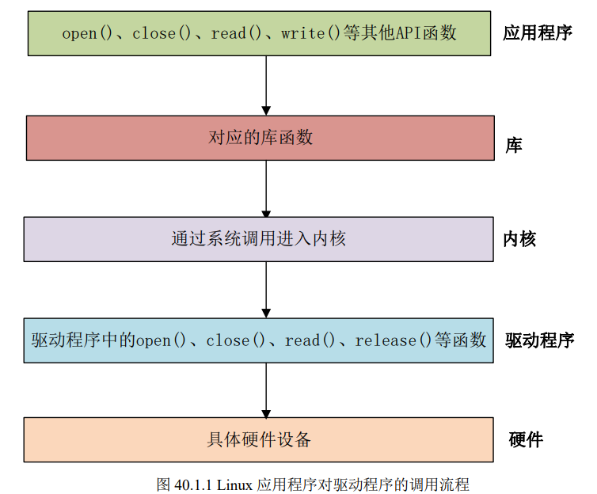
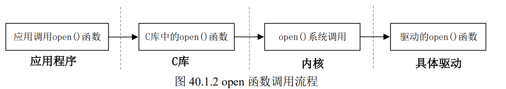
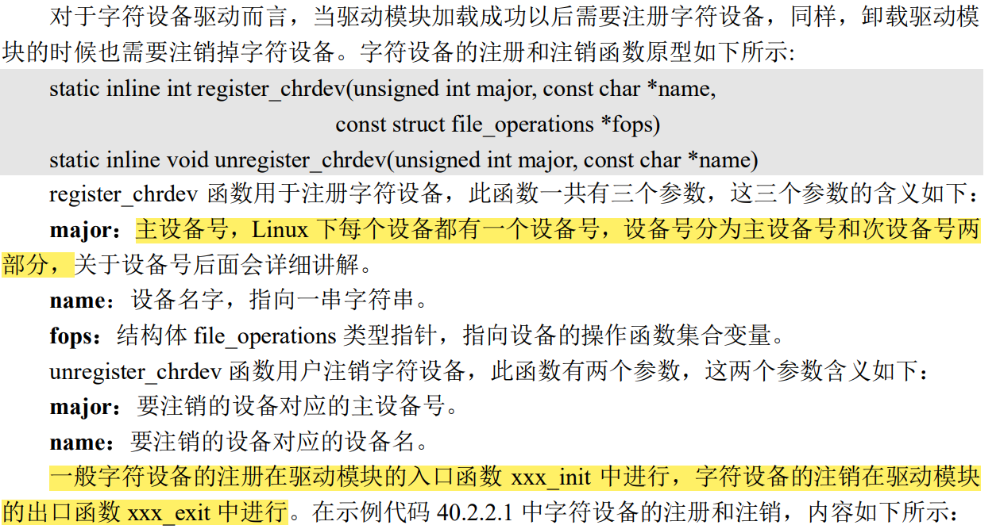

# Linux 驱动开发



应用程序运行在用户空间，而 Linux 驱动属于内核的一部分，因此驱动运行于内核空间

如open函数的流程：


*__每一个系统调用，在驱动中都有与之对应的一个驱动函数，在 Linux 内核文件 include/linux/fs.h 中
有个叫做 file_operations 的结构体，此结构体就是 Linux 内核驱动操作函数集合__*

### 驱动模块的加载和卸载
Linux 驱动有两种运行方式：
1. 第一种就是将驱动编译进 Linux 内核中，这样当 Linux 内核启动的时候就会自动运行驱动程序。
2. 第二种就是将驱动编译成模块(Linux 下模块扩展名为.ko)，在Linux 内核启动以后使用“insmod”命令加载驱动模块

__模块加载和卸载注册函数__
```
module_init(xxx_init); //注册模块加载函数
module_exit(xxx_exit); //注册模块卸载函数
```

`module_init` 函数用来向 `Linux 内核`注册一个模块加载函数，参数 `xxx_init` 就是需要注册的具体函数，当使用“`insmod`”命令加载驱动的时候，`xxx_init` 这个函数就会被调用

字符设备驱动模块加载和卸载模板如下:
```
/* 驱动入口函数 */
static int __init xxx_init(void)  //定义了个名为 xxx_init 的驱动入口函数，并且使用了“__init”来修饰
    {
/* 入口函数具体内容 */
return 0;
    }

/* 驱动出口函数 */
static void __exit xxx_exit(void)  //，定义了个名为 xxx_exit 驱动出口函数，并且使用了“__exit”来修饰
    {
 /* 出口函数具体内容 */
    }

 /* 将上面两个函数指定为驱动的入口和出口函数 */
 module_init(xxx_init);
 module_exit(xxx_exit);
```

- 驱动编译完成以后扩展名为.ko
- 有两种命令可以加载驱动模块：insmod和modprobe
  1. insmod是最简单的模块加载命令，此命令用于加载指定的.ko 模块,如
   ```
   insmod drv.ko
   ```
    2. insmod 命令不能解决模块的依赖关系，比如 drv.ko 依赖 first.ko 这个模块，就必须先使用insmod 命令加载 first.ko 这个模块，然后再加载 drv.ko 这个模块.但是 modprobe 就不会存在这个问题，modprobe 会分析模块的依赖关系，然后会将所有的依赖模块都加载到内核中
    3. modprobe 命令主要智能在提供了模块的依赖性分析、错误检查、错误报告等功能，推荐使用 modprobe 命令来加载驱动
    4. 使用 modprobe 命令可以卸载掉驱动模块所依赖的其他模块，前提是这些依赖模块已经没有被其他模块所使用，否则就不能使用 modprobe 来卸载驱动模块


### 字符设备注册与注销
`register_chrdev` 和 `unregister_chrdev` 这两个函数是老版本驱动使用的函数，现在新的字符设备驱动已经不再使用这两个函数，而是使用Linux内核推荐的新字符设备驱动API函数


#### 实现设备的具体操作函数
file_operations 结构体就是设备的具体操作函数，其中对字符设备有如下两个要求：
1. 能够对字符设备进行打开和关闭操作。设备打开和关闭是最基本的要求，几乎所有的设备都得提供打开和关闭的功能。因此我们需要实现 file_operations 中的 open 和 release 这两个函数
2. 对字符设备能实现读写操作

加入设备操作函数模块如下：
```
/* 打开设备 */
 static int chrtest_open(struct inode *inode, struct file *filp)
{
/* 用户实现具体功能 */
return 0;
}
 
 /* 从设备读取 */
static ssize_t chrtest_read(struct file *filp, char __user *buf, size_t cnt, loff_t *offt)
 {
 /* 用户实现具体功能 */
 return 0;
 }

 /* 向设备写数据 */
 static ssize_t chrtest_write(struct file *filp,const char __user *buf,size_t cnt, loff_t *offt)
 {
 /* 用户实现具体功能 */
 return 0;
 }

 /* 关闭/释放设备 */
 static int chrtest_release(struct inode *inode, struct file *filp)
 {
 /* 用户实现具体功能 */
 return 0;
 }

 static struct file_operations test_fops = {
 .owner = THIS_MODULE, 
 .open = chrtest_open,
 .read = chrtest_read,
 .write = chrtest_write,
 .release = chrtest_release,
 };

 /* 驱动入口函数 */
 static int __init xxx_init(void)
 {
 /* 入口函数具体内容 */
 int retvalue = 0;

 /* 注册字符设备驱动 */
 retvalue = register_chrdev(200, "chrtest", &test_fops);
 if(retvalue < 0){
 /* 字符设备注册失败,自行处理 */
 }
 return 0;
 }

 /* 驱动出口函数 */
 static void __exit xxx_exit(void)
 {
 /* 注销字符设备驱动 */
 unregister_chrdev(200, "chrtest");
 }

 /* 将上面两个函数指定为驱动的入口和出口函数 */
 module_init(xxx_init);
 module_exit(xxx_exit);

```

##### 添加LICENSE和作者信息
```
MODULE_LICENSE() //添加模块 LICENSE 信息，必要
MODULE_AUTHOR() //添加模块作者信息 ,非必要
```

### 设备号
__Linux上每个设备都有一个设备号，由`主设备号`和`次设备号`组成。主设备号表示某一个具体的驱动，次设备号表示使用这个驱动的各个设备。Linux 提供了一个名为 `dev_t` 的数据类型表示设备号，dev_t 定义在文件 `include/linux/types.h` 里面(dev_t是_u32类型，即unsigned int,其中32位里面高12位为主设备号，低20位为次设备号，因此 Linux系统中主设备号范围为 0~4095，所以在选择主设备号的时候一定不要超过这个范围)__

##### 设备号分配
1. 静态分配，可以通过`cat /proc/devices`来查看当前系统中所有已经使用了的设备号
2. 可以让系统自动给你分配一个设备号，使用以下函数：

```
int alloc_chrdev_region(dev_t *dev, unsigned baseminor,unsigned count, const char *name)
//dev：保存申请到的设备号
//baseminor：次设备号起始地址，alloc_chrdev_region 可以申请一段连续的多个设备号，这些设备号的主设备号一样，但是次设备号不同，次设备号以 baseminor 为起始地址地址开始递增。一般 baseminor 为 0，也就是说次设备号从 0 开始。
//count：要申请的设备号数量。
//name：设备名字


注销字符设备后要释放设备号，使用以下函数：
void unregister_chrdev_region(dev_t from, unsigned count)
//from：要释放的设备号。
//count：表示从 from 开始，要释放的设备号数量。


```


#### 注册进程终止处理函数`atexit`
atexit()库函数用于注册一个进程在**正常终止**时要调用的函数

```
#include <stdlib.h>
int atexit(void (*function)(void));

```


### LED
Linux 下的任何外设驱动，最终都是要配置相应的硬件寄存器

#### 地址映射
Linux 内核启动的时候会初始化 `MMU`，设置好内存映射，设置好以后 CPU 访问的都是虚拟地址

`MMU`主要功能是：
1. 完成虚拟空间到物理空间的映射
2. 内存保护，设置存储器的访问权限，设置虚拟存储空间的缓冲特性

在涉及物理内存和虚拟内存之间的交互，使用`ioremap`和`iounmap`这两个函数

#### ioremap函数
`ioremap` 函数用于获取指定**物理地址空间对应的虚拟地址空间**，定义在
`arch/arm/include/asm/io.h` 文件中
```
#define ioremap(cookie,size) __arm_ioremap((cookie), (size), 
MT_DEVICE)

 void __iomem * __arm_ioremap(phys_addr_t phys_addr, size_t size, 
unsigned int mtype)
 {
 return arch_ioremap_caller(phys_addr, size, mtype,
__builtin_return_address(0));
 }

 //ioremap 是个宏，有两个参数：cookie 和 size，真正起作用的是函数__arm_ioremap，此函
数有三个参数和一个返回值
//phys_addr:要映射的物理起始地址
//size:要映射的内存空间大小
//ioremap 的类型，可以选择 MT_DEVICE、MT_DEVICE_NONSHARED、
MT_DEVICE_CACHED 和 MT_DEVICE_WC，ioremap 函数选择 MT_DEVICE
//返回值是__iomem 类型的指针，指向映射后的虚拟空间首地址
```

#### iounmap 函数
卸载驱动的时候需要使用 iounmap 函数释放掉 ioremap 函数所做的映射

```
void iounmap (volatile void __iomem *addr)
//iounmap 只有一个参数 addr，此参数就是要取消映射的虚拟地址空间首地址
```

### 内存访问函数
当外部寄存器或内存映射到 IO 空间时，称为 I/O 端口。当外部寄存器或内存映射到内存空间时，称为 I/O 内存。但是对于 ARM 来说没有 I/O 空间这个概念，因此 ARM 体系下只有 I/O 内存(可以直接理解为内存)。使用 ioremap 函数将寄存器的物理地址映射到虚拟地址以后，我们就可以直接通过指针访问这些地址，但是 Linux 内核不建议这么做，而是推荐使用一组操作函数来对映射后的内存进行读写操作

1. 读操作函数

```
u8 readb(const volatile void __iomem *addr)
u16 readw(const volatile void __iomem *addr)
u32 readl(const volatile void __iomem *addr)
//参数 addr 就是要读取写内存地址，返回值就是读取到的数据
```

2. 写操作函数
```
void writeb(u8 value, volatile void __iomem *addr)
void writew(u16 value, volatile void __iomem *addr)
void writel(u32 value, volatile void __iomem *addr)
//参数 value 是要写入的数值，addr 是要写入的地址
 ```

### 新字符设备驱动
`register_chrdev` 和 `unregister_chrdev `这两个函数是老版本驱动使用的函数，现在新的字符设备驱动已经不再使用这两个函数，而是使用Linux内核推荐的新字符设备驱动API函数


#### 新字符设备注册方法

**字符设备结构**：在 Linux 中使用 `cdev` 结构体表示一个字符设备，cdev 结构体在 include/linux/cdev.h 文件中的定义如下：
```
struct cdev {
    struct kobject kobj;
    struct module *owner;
    const struct file_operations *ops;  //字符设备文件操作函数集合
    struct list_head list;
    dev_t dev;    //设备号
    unsigned int count; 
};
```

#### cdev_init 函数
定义好 cdev 变量以后就要使用 `cdev_init` 函数对其进行初始化
```
void cdev_init(struct cdev *cdev, const struct file_operations *fops)
//参数 cdev 就是要初始化的 cdev 结构体变量，参数 fops 就是字符设备文件操作函数集合
```

#### cdev_add 函数 (Linux 内核中大量的字符设备驱动都是采用这种方法向 Linux 内核添加字符设备)
`cdev_add` 函数用于向 Linux 系统`添加字符设备(cdev 结构体变量)`，**首先使用 cdev_init 函数,完成对 cdev 结构体变量的初始化，然后使用cdev_add 函数向 Linux 系统添加这个字符设备**
```
int cdev_add(struct cdev *p, dev_t dev, unsigned count)
//参数 p 指向要添加的字符设备(cdev 结构体变量)，参数 dev 就是设备所使用的设备号，参数 count 是要添加的设备数量
```

#### cdev_del 函数
卸载驱动的时候一定要使用 cdev_del 函数从 Linux 内核中删除相应的字符设备
```
void cdev_del(struct cdev *p)
//参数 p 就是要删除的字符设备
```

### 自动创建设备节点
在驱动中实现自动创建设备节点的功能以后，使用 modprobe 加载驱动模块成功的话就会自动在/dev 目录下创建对应的设备文件

#### mdev机制
udev 是一个用户程序，在 Linux 下通过 udev 来实现设备文件的创建与删除，udev 可以检测系统中硬件设备状态，可以根据系统中硬件设备状态来创建或者删除设备文件。比如使用modprobe 命令成功加载驱动模块以后就自动在/dev 目录下创建对应的设备节点文件,使用rmmod 命令卸载驱动模块以后就删除掉/dev 目录下的设备节点文件。使用 busybox 构建根文件系统的时候，busybox 会创建一个 udev 的简化版本———mdev，所以在嵌入式 Linux 中我们使用mdev 来实现设备节点文件的自动创建与删除，Linux 系统中的热插拔事件也由 mdev 管理

#### 创建和删除类
自动创建设备节点的工作是在驱动程序的`入口函数`中完成的，一般在 `cdev_add `函数后面添加自动创建设备节点相关代码。首先要创建一个 `class` 类，`class` 是个`结构体`，定义在文件`include/linux/device.h `里面。`class_create` 是**类创建函数**，`class_create` 是个宏定义

```
#define class_create(owner, name) \
 ({ \
 static struct lock_class_key __key; \
 __class_create(owner, name, &__key); \
 })

 struct class *__class_create(struct module *owner, const char *name,
 struct lock_class_key *key)
```
`class_create`展开后是：
```
struct class *class_create (struct module *owner, const char *name)
```
class_create 一共有两个参数，参数 owner 一般为 `THIS_MODULE`，参数 name 是`类名字`。返回值是个指向结构体 class 的`指针`，也就是创建的类

卸载驱动程序的时候需要删除掉类，类删除函数为 `class_destroy`
```
void class_destroy(struct class *cls);//参数 cls 就是要删除的类
```


#### 创建设备
创建好类以后还不能实现自动创建设备节点，我们还需要在这个类下创建一个设备，使用 `device_create` 函数在类下面`创建设备`
```
//device_create 是个可变参数函数
struct device *device_create(struct class *class,  //参数class 就是设备要创建哪个类下面
struct device *parent,   //；参数 parent 是父设备，一般为 NULL，也就是没有父设备
dev_t devt,     //参数 devt 是设备号
void *drvdata,  //参数 drvdata 是设备可能会使用的一些数据，一般为 NULL
const char *fmt, //参数 fmt 是设备名字，如果设置 fmt=xxx 的话，就会生成/dev/xxx这个设备文件
...)

//返回值就是创建好的设备
```

同样的，卸载驱动的时候需要**删除掉创建的设备**，设备删除函数为 `device_destroy`
```
void device_destroy(struct class *class, dev_t devt)
//参数 class 是要删除的设备所处的类
//参数 devt 是要删除的设备号
```

__*在驱动入口函数里面创建类和设备，在驱动出口函数里面删除类和设备*__

模板如下：
```
 struct class *class;   /* 类 */ 
 struct device *device; /* 设备 */
 dev_t devid;           /* 设备号 */ 
 
 /* 驱动入口函数 */
 static int __init led_init(void)
 {
 /* 创建类 */
    class = class_create(THIS_MODULE, "xxx");
 /* 创建设备 */
    device = device_create(class, NULL, devid, NULL, "xxx");
    return 0;
 }

 /* 驱动出口函数 */
 static void __exit led_exit(void)
 {
 /* 删除设备 */
    device_destroy(newchrled.class, newchrled.devid);
 /* 删除类 */
    class_destroy(newchrled.class);
 }

 module_init(led_init);
 module_exit(led_exit);
```

#### 设置文件私有数据
每个硬件设备都有一些属性，比如主设备号(dev_t)，类(class)、设备(device)、开关状态(state)等等，在编写驱动的时候你可以将这些属性全部写成变量的形式。对于一个设备的所有属性信息我们最好将其做成一个结构体
```
/* 设备结构体作为私有数据 */
 struct test_dev{
    dev_t devid; /* 设备号 */
    struct cdev cdev; /* cdev */
    struct class *class; /* 类 */
    struct device *device; /* 设备 */
    int major; /* 主设备号 */
    int minor; /* 次设备号 */
 };
 
 struct test_dev testdev;
 
 /* open 函数 */
 static int test_open(struct inode *inode, struct file *filp)
 {
    filp->private_data = &testdev; /* 设置私有数据 */
    return 0;
 }
```


