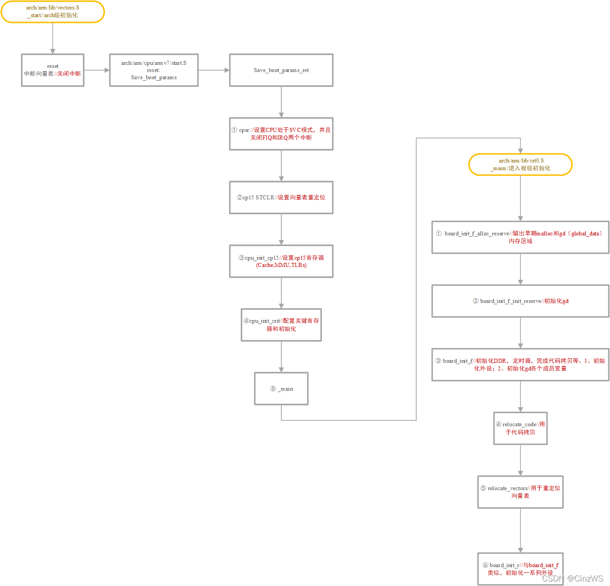

# Linux Uboot


<br/>

Uboot的链接文件是`u-boot.lds`
uboot的`入口处`是`arch/arm/lib/vectors.S 文件中的_start`
```
//中断向量表
_start:

#ifdef CONFIG_SYS_DV_NOR_BOOT_CFG
	.word	CONFIG_SYS_DV_NOR_BOOT_CFG
#endif

	b	reset  //跳转reset函数
	ldr	pc, _undefined_instruction
	ldr	pc, _software_interrupt
	ldr	pc, _prefetch_abort
	ldr	pc, _data_abort
	ldr	pc, _not_used
	ldr	pc, _irq
	ldr	pc, _fiq
```

`reset函数`在` arch/arm/cpu/armv7/start.S`
```
	.globl	reset
	.globl	save_boot_params_ret

reset:  //reset函数
	/* Allow the board to save important registers */
	b	save_boot_params
```
在`reset函数`中跳转到`save_boot_params函数`,同样也是定义在`start.S`中
```
ENTRY(save_boot_params)
	b	save_boot_params_ret		@ back to my caller
```
`save_boot_params函数`跳转到`save_boot_params_ret函数`
```
save_boot_params_ret:
//设置处理器为SVC工作模式，并且禁止FIQ和IRQ中断
	/*
	 * disable interrupts (FIQ and IRQ), also set the cpu to SVC32 mode,
	 * except if in HYP mode already
	 */
	mrs	r0, cpsr
	and	r1, r0, #0x1f		@ mask mode bits
	teq	r1, #0x1a		@ test for HYP mode
	bicne	r0, r0, #0x1f		@ clear all mode bits
	orrne	r0, r0, #0x13		@ set SVC mode
	orr	r0, r0, #0xc0		@ disable FIQ and IRQ
	msr	cpsr,r0
```
主要是为了设置处理器为SVC工作模式，并且禁止FIQ和IRQ中断

接着继续执行下方的代码
```
//以上先清除V位，然后将_start地址写入VBAR，完成设置中断向量表的偏移
#if !(defined(CONFIG_OMAP44XX) && defined(CONFIG_SPL_BUILD))
	/* Set V=0 in CP15 SCTLR register - for VBAR to point to vector */

	//设置向量表重定位
	mrc	p15, 0, r0, c1, c0, 0	@ Read CP15 SCTLR Register
	bic	r0, #CR_V		@ V = 0
	mcr	p15, 0, r0, c1, c0, 0	@ Write CP15 SCTLR Register

	/* Set vector address in CP15 VBAR register */
	ldr	r0, =_start    //_start的起始地址赋给r0，是整个uboot的起始地址，也是向量表的起始地址
	mcr	p15, 0, r0, c12, c0, 0	@Set VBAR
#endif

	/* the mask ROM code should have PLL and others stable */
#ifndef CONFIG_SKIP_LOWLEVEL_INIT

	//初始化设置cp15和crit寄存器
	bl	cpu_init_cp15    //函数 cpu_init_cp15 用来设置 CP15 相关的内容
	bl	cpu_init_crit	//设置sp等寄存器
#endif

	bl	_main
```
前面部分主要是设置向量表重定位的，后面部分就分别调用`cpu_init_cp15`和`cpu_init_crit`和`_main`函数，`cpu_init_cp15`主要是一些和CP15相关的内容，而`cpu_init_crit`函数是定义在`start.S`中
```
/*************************************************************************
 *
 * CPU_init_critical registers
 *
 * setup important registers
 * setup memory timing
 *
 *************************************************************************/
ENTRY(cpu_init_crit)
	/*
	 * Jump to board specific initialization...
	 * The Mask ROM will have already initialized
	 * basic memory. Go here to bump up clock rate and handle
	 * wake up conditions.
	 */
	b	lowlevel_init		@ go setup pll,mux,memory
ENDPROC(cpu_init_crit)
#endif
```
可以看出函数 `cpu_init_crit` 内部仅仅是调用了函数 `lowlevel_init`,因此下面主要看`lowlevel_init`和`_main`函数


### lowlevel_init函数
`lowlevel_init`在`arch/arm/cpu/armv7/lowlevel_init.S`中