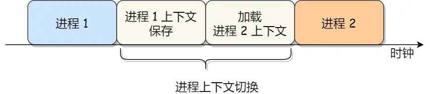

# Operating System

### 用户线程与内核线程
#### 用户线程
*__用户线程的整个线程管理和调度，操作系统是不直接参与的，而是由`用户级线程库函数`来完成线程的管理，包括线程的创建、终止、同步和调度等__*

__用户线程的优点__：
1. 每个进程都需要有它私有的线程控制块（TCB）列表，用来跟踪记录它各个线程状态信息（PC、栈指针、寄存器），TCB 由用户级线程库函数来维护，可用于不支持线程技术的操作系统
2. 用户线程的切换也是由线程库函数来完成的，无需用户态与内核态的切换，所以速度特别快

__用户线程的缺点__：
1. 由于操作系统不参与线程的调度，如果一个线程发起了系统调用而阻塞，那进程所包含的用户线程都不能执行了
2. 当一个线程开始运行后，除非它主动地交出 CPU 的使用权，否则它所在的进程当中的其他线程无法运行，因为用户态的线程没法打断当前运行中的线程，它没有这个特权，只有操作系统才有，但是用户线程不是由操作系统管理的
3. 由于时间片分配给进程，故与其他进程比，在多线程执行时，每个线程得到的时间片较少，执行会比较慢

##### 内核线程
*__内核线程是由操作系统管理的，线程对应的 TCB 自然是放在操作系统里的，这样线程的创建、终止和管理都是由`操作系统`负责__*

__内核线程的优点__:
1. 在一个进程当中，如果某个内核线程发起系统调用而被阻塞，并不会影响其他内核线程的运行
2. 分配给线程，多线程的进程获得更多的 CPU 运行时间

__内核线程的缺点__:
1. 在支持内核线程的操作系统中，由内核来维护进程和线程的上下文信息，如 PCB 和 TCB
2. 线程的创建、终止和切换都是通过系统调用的方式来进行，因此对于系统来说，系统开销比较大

### 进程上下文
*__进程是由内核管理和调度的，所以进程的切换只能发生在`内核态`__*

- 进程的上下文切换不仅包含了虚拟内存、栈、全局变量等用户空间的资源，还包括了内核堆栈、寄存器等内核空间的资源
- 通常，会把交换的信息保存在进程的 PCB，当要运行另外一个进程的时候，我们需要从这个进程的 PCB 取出上下文，然后恢复到 CPU 中，这使得这个进程可以继续执行

### 线程上下文
- 当两个线程不是属于同一个进程，则切换的过程就跟进程上下文切换一样
- 当两个线程是属于同一个进程，因为虚拟内存是共享的，所以在切换时，虚拟内存这些资源就保持不动，只需要切换线程的私有数据、寄存器等不共享的数据